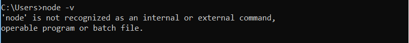
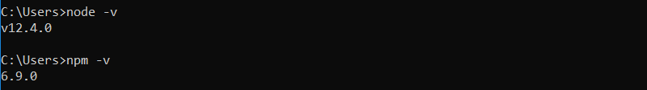
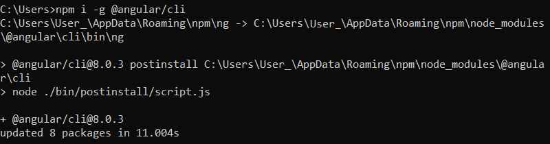
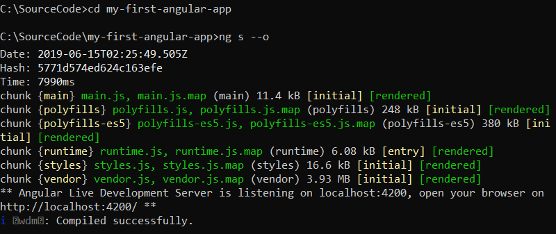
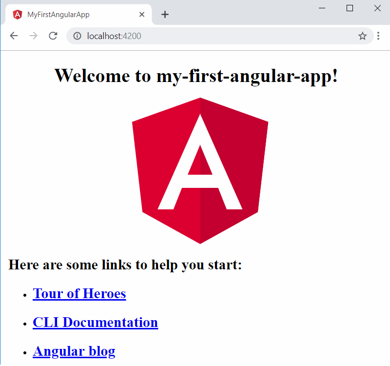
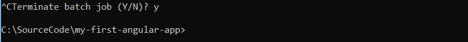

Let’s start by creating your first basic Angular application.

## Preparation

### Install an editor

Select and install one of the existing Angular code editors:
* [Visual Studio Code](https://code.visualstudio.com/)
* [Atom](https://atom.io/)
* You also can use Visual Studio or any other Angular code editor(Sublime Text, Webstorm, Angular IDE, etc). 

*You can skip this step and come back to it later to progress with development Angular application.*

I’ll use Visual Studio Code and cmd in this sample.

### Install Node JS

Check if you already have Node JS on your machine, by running the following command in console from any location:

~~~
> node -v
~~~

If you see the following "not recognized" message, you have to install [NodeJS](https://nodejs.org/en/) first:

In other case you will see the Node JS version. You can also check npm (Node JS package manager) version by running the command:

~~~
> npm -v
~~~

### Install Angular CLI

To install Angular CLI run the following command in cmd:

~~~
> npm i -g @angular/cli  
~~~

Where **i** is short for install and **-g** is flag for global installation. Global means that angular-cli package will be available for all Angular applications on your machine.

The 8th version of Angular CLI was installed.

## Create

You can progress in the same terminal or open Visual Studio Code and continue there, by selecting Terminal in the menu.

In selected terminal navigate to source code folder on you machine and create new "my-first-angular-app" Angular project:

~~~
> ng new my-first-angular-app
~~~

<video controls>
  <source src=".\init-angular-app.mp4" width="350" type="video/mp4">Create new Angular Project
</video>

Angular CLI will create the application environment for you and install npm packages.

Congratulations, your first Angular application is created!

## Run

To try your new application go to application folder in the terminal and run serve command:

~~~
> ng s --o
~~~

Where **s** is short for serve and **--o** is short for open flag.

*You can serve the application without open flag, but in this case you should open http://localhost:4200/ manually in the browser.*

The application will be built and run.

Take a look at your first Angular application in browser: 

## Finish

It's not enough to close the browser to stop the application. You should stop it in the terminal.

Click ctrl+c to stop the server and answer y for "Terminate batch job (Y/N)?" question:

*It's not necessary to stop and run the application for every change. You can make the changes in the code and see them immediately in browser.*
