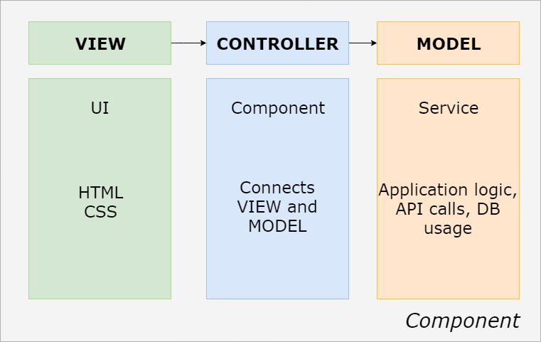

[Angular](https://angular.io/) is an open-source web framework developed by Google. It has all you need to create a rich cross-platform web (web, mobile, mobile native, desktop native) application.

The framework supports OOP principals and is component based.

The components are built using MVC pattern. Angular uses typescript.

Here is a picture to show the Angular component:

You can make modules from components as components are reusable. The modules will make code easy to understand, maintain, and fit for unit testing

Examples of sites built with Angular:

* [Forbes](https://www.forbes.com)
* [Microsoft Customers](https://customers.microsoft.com/en-us)
* [Google Express](https://express.google.com/)
* [Microsoft Office Home](https://www.office.com/apps?auth=2)
* [Delta](https://www.delta.com/)
* and much more...
