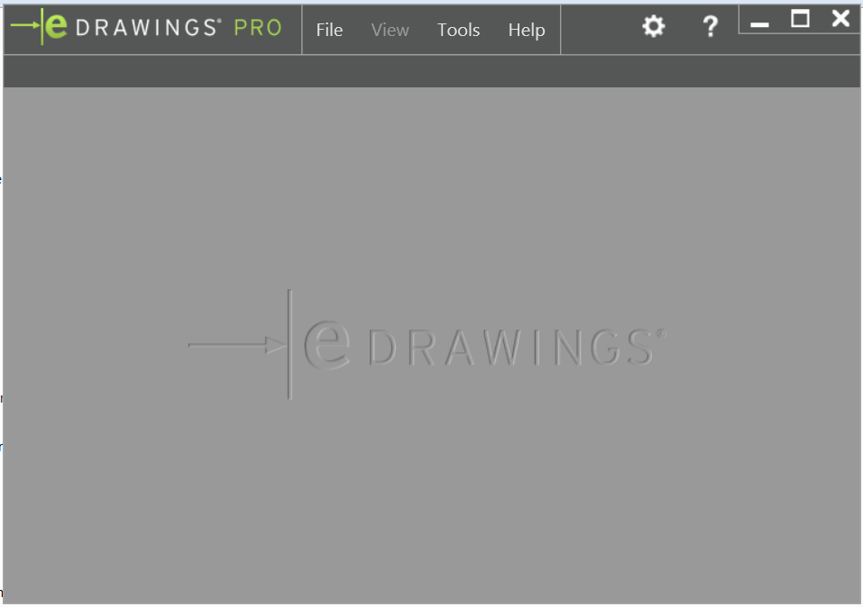
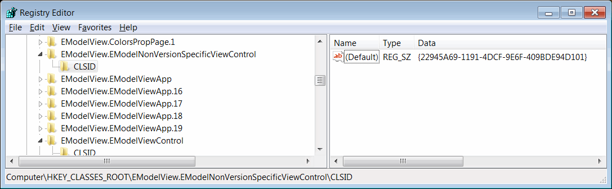
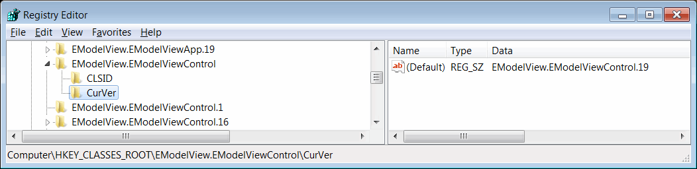
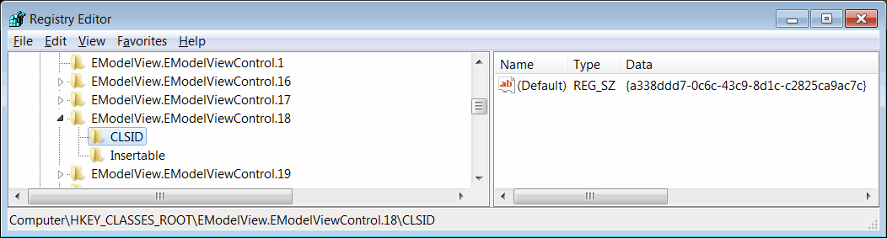

{ width=350 }

eDrawings API can be utilized by hosting the eDrawings ActiveX control and calling its methods. 

Control implements [IEModelViewControl](http://help.solidworks.com/2016/english/api/emodelapi/eDrawings.Interop.EModelViewControl~eDrawings.Interop.EModelViewControl.IEModelViewControl.html) interface and represents the top most object in API objects model.

[IEModelMarkupControl](http://help.solidworks.com/2016/english/api/emodelapi/eDrawings.Interop.EModelMarkupControl~eDrawings.Interop.EModelMarkupControl.IEModelMarkupControl.html) enables API access to markup functionality of eDrawings. Follow [Utilizing markup functionality using SOLIDWORKS eDrawings API](/edrawings-api/markup/) for more information about eDrawings markup API.

eDrawings control can be hosted in unmanaged applications as ActiveX control as well as .NET applications on [User Forms](winforms), [WPF application](wpf) and HTML pages.

Interop dll can be located in the installation folder of the eDrawings. Usually *%commonprogramfiles%\eDrawings[Version]\eDrawings.Interop.EModelViewControl.dll*

In .NET applications eDrawings host control can be created by implementing [AxHost](https://docs.microsoft.com/en-us/dotnet/api/system.windows.forms.axhost).

~~~ cs
public class EDrawingHost : AxHost
{
    public EDrawingHost() : base("22945A69-1191-4DCF-9E6F-409BDE94D101")
    {
        m_IsLoaded = false;
    }
}
~~~

The guid of the control can be located in the registry.

Version independent guid can be found at *HKEY_CLASSES_ROOT\EModelView.EModelNonVersionSpecificViewControl\CLSID* registry key and equal to *{22945A69-1191-4DCF-9E6F-409BDE94D101}*

If multiple versions of the eDrawings control installed the version independent GUID would correspond the to current version which is set in the *HKEY_CLASSES_ROOT\EModelView.EModelViewControl\CurVer* registry key:

In order to enable specific version of eDrawings it is required to use the specific guid. For example for the eDrawings 2018 guid can be found at *HKEY_CLASSES_ROOT\EModelView.EModelViewControl.18\CLSID* registry key and equal to *{a338ddd7-0c6c-43c9-8d1c-c2825ca9ac7c}*.

eDrawings interfaces from the *eDrawings.Interop.EModelViewControl.dll* are neither backwards nor forward compatible. It means OCX control can only be cast to the corresponding interop version as all interfaces have different GUIDs in different versions. As a workaround it is possible to use late binding and [ComEventsHelper](https://docs.microsoft.com/en-us/dotnet/api/system.runtime.interopservices.comeventshelper?view=netcore-3.1) to access eDrawings API. See [this implementation](https://github.com/xarial/cad-plus/blob/master/src/SwEDrawingsHost/EDrawingsControl.cs).