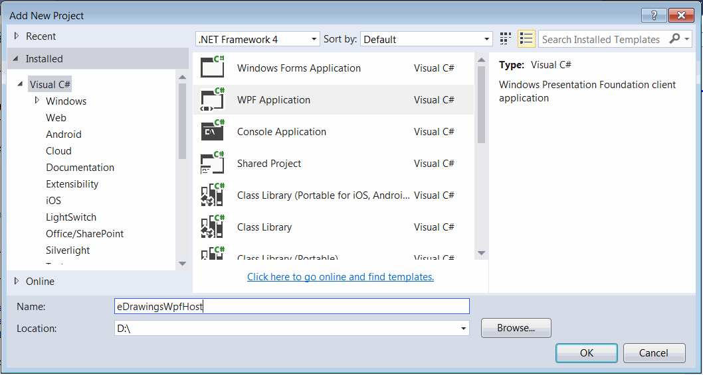
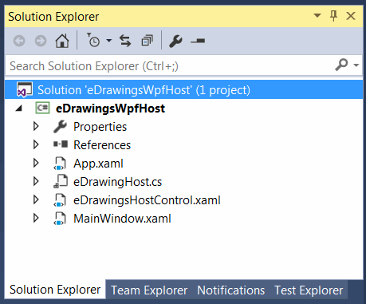
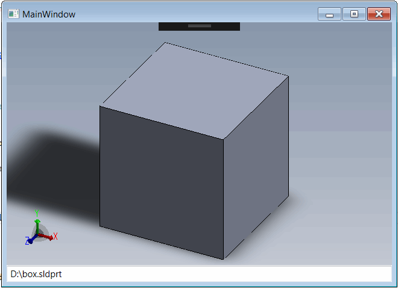

eDrawings API doesn't provide a native WPF control to be used in WPF. It is however possible to use the [WindowsFormsIntegration](https://docs.microsoft.com/en-us/dotnet/api/system.windows.forms.integration) framework to host Windows Forms Control in the Windows Presentation Foundation (WPF) environment. Follow [Hosting eDrawings control in Windows Forms](/edrawings-api/gettings-started/winforms/) guide of creating the eDrawings control for Windows Forms.

## Creating new project

* Start Visual Studio
* Create new project and select *WPF Application* in the *Visual C#* templates section
{ width=550 }
* Follow the [Hosting eDrawings control in Windows Forms](/edrawings-api/gettings-started/winforms/) guide for steps of adding eDrawings interop
* Add reference to *WindowsFormsIntegration*

## Creating the eDrawings WPF control

Create a wrapper for the eDrawings host Windows Forms control

### eDrawingHost.cs



Create new WPF User Control which will host eDrawings and can be placed on other WPF controls or WPF windows

The solution tree will be similar to the one below.

{ width=350 }

### eDrawingsHostControl.xaml

There will be no logic or additional markup in the XAML of the control and all will be implemented in the code behind



### eDrawingsHostControl.xaml.cs



In this example the control defines the dependency property *FilePath* which can be bound and represent the path to the SOLIDWORKS file to be opened in the eDrawings

### MainWindow.xaml

Add the following markup to the MainWindow. It defines the text box control whose *Text* property is bound to *FilePath* dependency property of WPF eDrawing control. Which means that the file will be loaded immediately once the value in the text box is changed.



Change the path to file in the text box to see the file loaded into the WPF form.

{ width=350 }

Source code is available on [GitHub](https://github.com/codestackdev/solidworks-api-examples/tree/master/edrawings-api/eDrawingsWpfHost)
