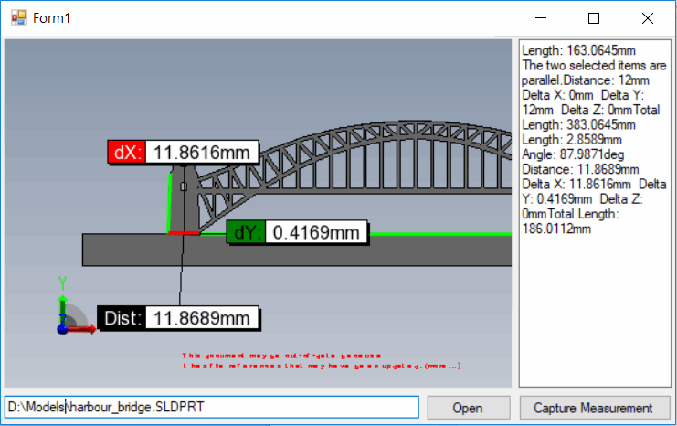

{ width=450 }

This example demonstrate how to use eDrawings markup API to capture the measurements of selected entities into a text box.

This example is based on [Hosting eDrawings control in Windows Forms](/edrawings-api/gettings-started/winforms/)

* Run the form
* Open any SOLIDWORKS or eDrawings file by specifying the full path to a file and clicking *Open* button
* Measurement is automatically enabled
* Select any entity or entities and click *Capture Measurement*. The measurement value is appended into a text box



Source code is available on [GitHub](https://github.com/codestackdev/solidworks-api-examples/tree/master/edrawings-api/MeasurementSurveying).
