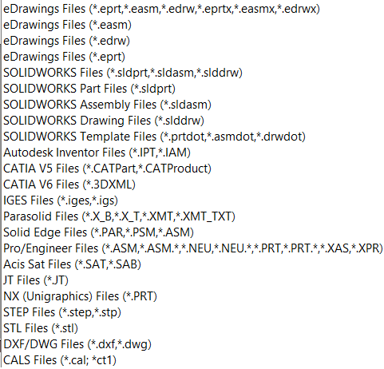
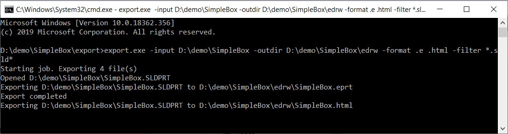

This console application developed in C# allows to export SOLIDWORKS, DXF, DWG, eDrawings files to foreign format (.jpg, .tif, .bmp, .stl, .exe, .htm, .zip, .edrw, .eprt, and .easm) using free version of SOLIDWORKS eDrawings via its API. It is not required to have SOLIDWORKS installed or use its license to use this tool.

This functionality has been integrated into the [xPort](https://cadplus.xarial.com/xport/) utility.

## Running the tool

This application can be run from the command line and with the following parameters:

* **-input** list of input directories or file paths to process. These are files which can be opened by eDrawings (e.g. SOLIDWORKS files, CATIA, STEP, DXF/DWG, etc.). Please see the complete list below:

{ width=250 }

* **-filter** filter to extract input files, if **-input** parameter contains directories
* **-outdir** - path to the directory to export results to. Tool will automatically create directory if it doesn't exist. If this parameter is not specified, files will be exported to the same folder as the input file.
* **-format** - list of formats to export the files to. Supported formats: .jpg, .tif, .bmp, .png, .stl, .exe, .htm, .zip, .edrw, .eprt, and .easm. Specify .e to export to the corresponding format of eDrawings (e.g. .sldprt is exported to .eprt, .sldasm to .easm, .slddrw to .edrw). If this parameter is not specified than file will be exported to eDrawings.

Tool should be called with the following format:

~~~
[parameter name] parameterValue1, parameterValue2 ... parameterValueN
~~~

Please see below example of parameters

## Example commands

* Export all SOLIDWORKS files (matching the filter *.sld*, i.e. extension starts with .sld) from the *SW Drawings* and *SW Models* folders in drive C (including sub folders) to the *C:\EDRW* folder in eDrawings format (.eprt for parts, .easm for assemblies, .edrw for drawing) and html format.

~~~
> export.exe -input "C:\SW Drawings" "C:\SW Models" -output C:\EDRW -filter *.sld* -format .e .html
~~~

* Export *C:\Models\Part.sldprt* into *C:\Models\Part.eprt*

~~~
> export.exe -input "C:\Models\Part.sldprt"
~~~

* Export all files in the *C:\Models* folder into the executable eDrawings format. Each file will be saved into the same folder as original input file.

~~~
> export.exe -input C:\Models -format .exe
~~~

## Results

Operation progress is displayed in the console window

Output files are created as per settings.

## EDrawingsHost.cs



## Program.cs



Source code is available on [GitHub](https://github.com/codestackdev/solidworks-api-examples/tree/master/edrawings-api/Export)
