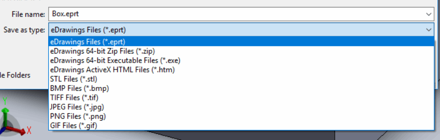

eDrawings enables exporting of the SOLIDWORKS files to the foreign format listed below:

{ width=450 }

Export can be performed via [IEModelViewControl::Save](https://help.solidworks.com/2016/English/api/emodelapi/eDrawings.Interop.EModelViewControl~eDrawings.Interop.EModelViewControl.IEModelViewControl~Save.html) eDrawings API method.

In addition to the above opened file can be printed via [IEModelViewControl::Print5](https://help.solidworks.com/2016/English/api/emodelapi/eDrawings.Interop.EModelViewControl~eDrawings.Interop.EModelViewControl.IEModelViewControl~Print5.html) eDrawings API method.
