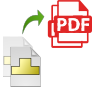
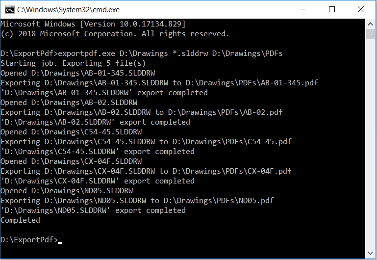
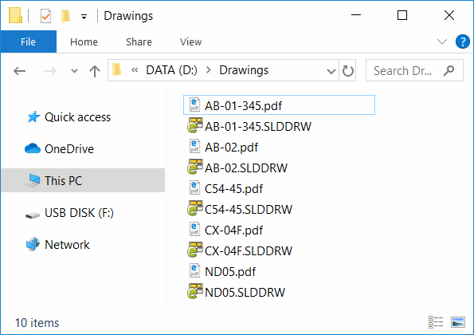

{ width=200 }

This console application developed in VB.NET allows to export SOLIDWORKS, DXF, DWG files to PDF using free version of SOLIDWORKS eDrawings via its API. It is not required to have SOLIDWORKS installed or use its license to use this tool. This tool is supported on Windows 8.1 onwards.

## Running the tool

This application can be run from the command line and expects 2 mandatory and one optional argument as described below:

1. Full path to input file or folder (in this case all files which match the filter will be exported)
1. Filter. Specify * for all files. Or *.slddrw for all SOLIDWORKS drawing files
1. (optional) Output folder to save PDF files. If not specified PDF files will be created in the same folder as input SOLIDWORKS files. Folder is automatically created if doesn't exist.

## Example commands

* Export all slddrw files in the *C:\SOLIDWORKS Drawings* folder (including sub folders) to the same location as source file

~~~
> exportpdf.exe "C:\SOLIDWORKS Drawings" "*.slddrw"
~~~

* Export all SOLIDWORKS drawings from *C:\SOLIDWORKS Drawings* folder (including sub folders) whose file name starts with *print_* to the *C:\PDFs* directory

~~~
> exportpdf.exe "C:\SOLIDWORKS Drawings" "print_*.slddrw" "C:\PDFs"
~~~

## Results

Operation progress is displayed in the console window

{ width=450 }

PDF files are created as per settings. PDF files are named after the source files they were generated from.

{ width=450 }

## EDrawingsHost.vb



## Module1.vb



Source code is available on [GitHub](https://github.com/codestackdev/solidworks-api-examples/tree/master/edrawings-api/BatchExportPdf)
