This article is a detailed step-by-step guidance to transfer the domain host from GoDaddy to Google Domains. There might be multiple reasons for transferring the domains from one registrar to another. This may include pricing, security, privacy features, flexibility, special offers, hosting options etc.

Some of the benefits of the Google Hosting over the GoDaddy hosting are:

* Free privacy protection for the host
* E-mail encryption for the free e-mail forwarding service

## Unlock account in GoDaddy

The transfer of the account should be initiated from the GoDaddy web-site.

Login to the web-site and click on *Manage* button for the domain you want to transfer.

Scroll down to the *Additional Settings* section and turn off the *Domain Lock* feature

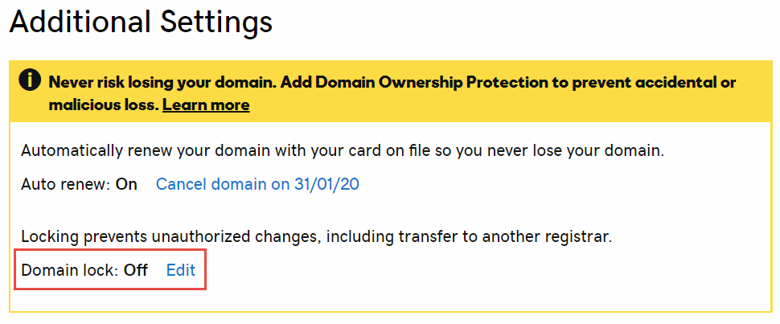

If you have enabled the privacy protection feature with GoDaddy it must be disabled before transferring. It could be reactivated in Google Domains later.

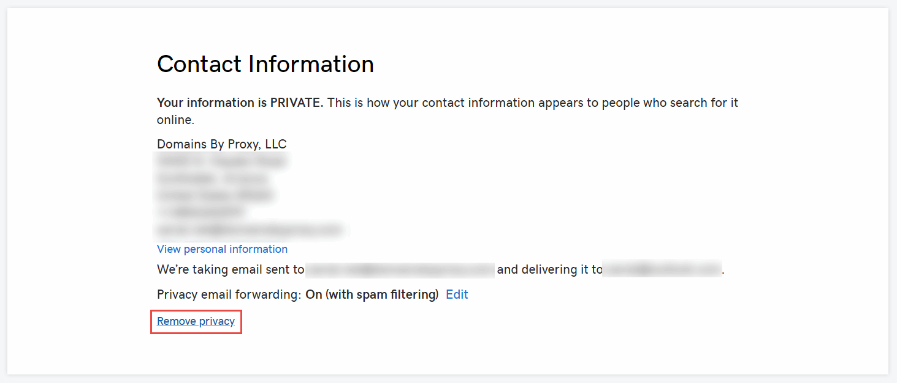

It might take several minutes for the feature to be disabled.

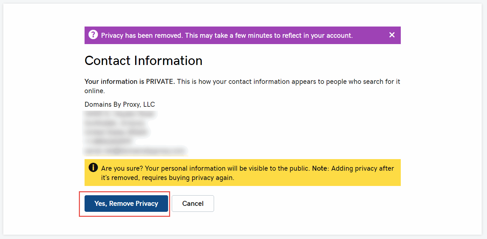

> If privacy feature is not turned off, the domain transfer won't complete and the *'Transfer rejected. Check with current registrar for more info'* message will be displayed in the Google Domains page

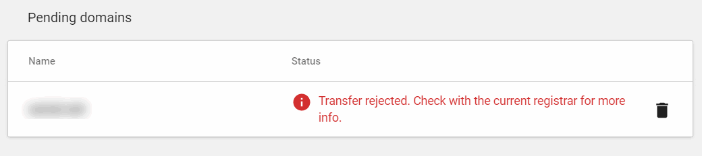

Click the *Get authorization code* button to generate temporarily token which needs to be pasted in Google Domain to authorize the transfer. Token will be e-mailed to the e-mail registered with GoDaddy.

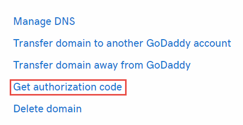{ width=250 }

> It is recommended to generate this token just before the transfer as it can expire and the transfer process may fail.

## Initiating transfer to Google Domains

Login to Google domains and activate the *Transfer* tab and search for the domain you want to transfer (the one you have unlocked in the previous step).

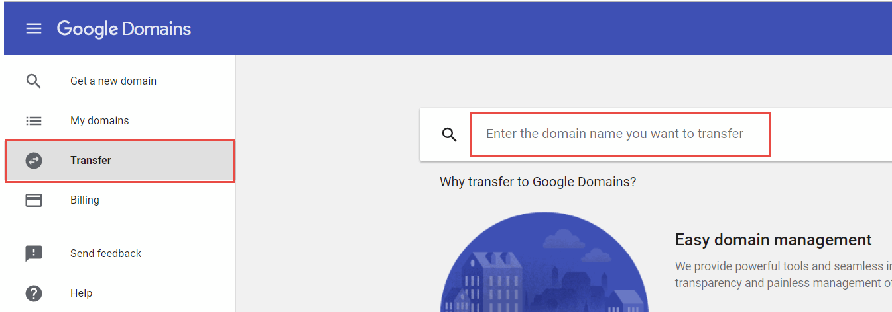

Hit enter on the search bar and follow the wizard to perform the transfer. Make sure that the *[domain name] is unlocked and ready to transfer* message is displayed in the first step. Paste the authorization token e-mailed from the previous step.

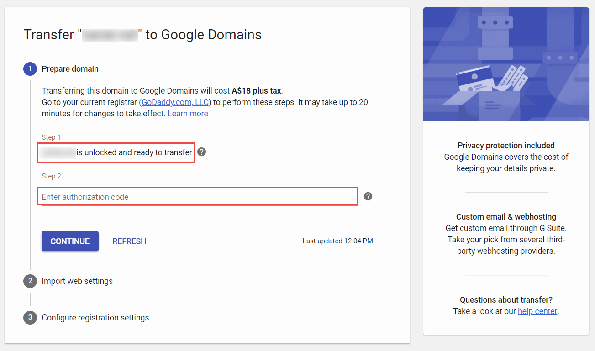

Specify the options you want to transfer from the previous settings (such as DNS records). You might want to use the default selections.

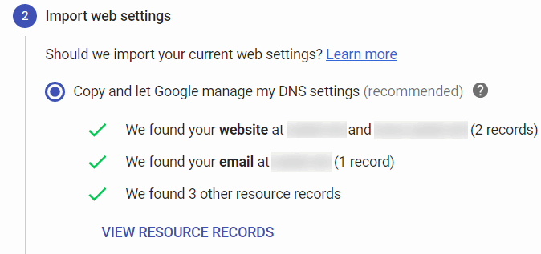{ width=350 }

Configure the privacy and auto renew options in the next step

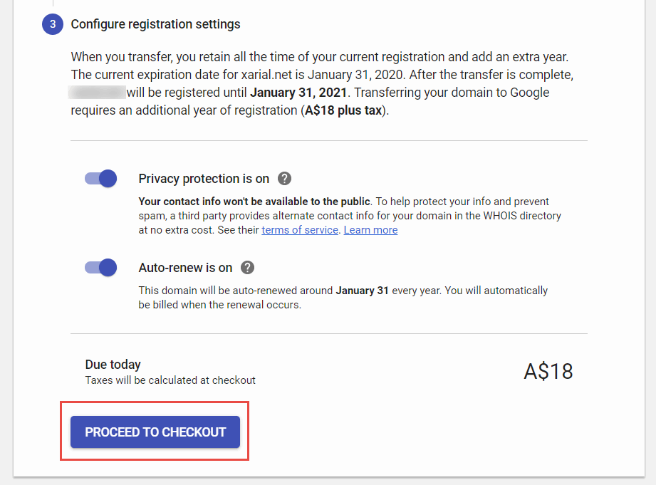{ width=450 }

Fill the purchase form to finalize the transfer.

> Note it is required to pay for one year maintenance of domain ahead to perform the transfer. However the existing period of registration will be preserved. For example, if the domain was due to expire in 1 year (e.g. January 2020) transferring this to Google Domains will extended this for one more year (e.g. January 2021).

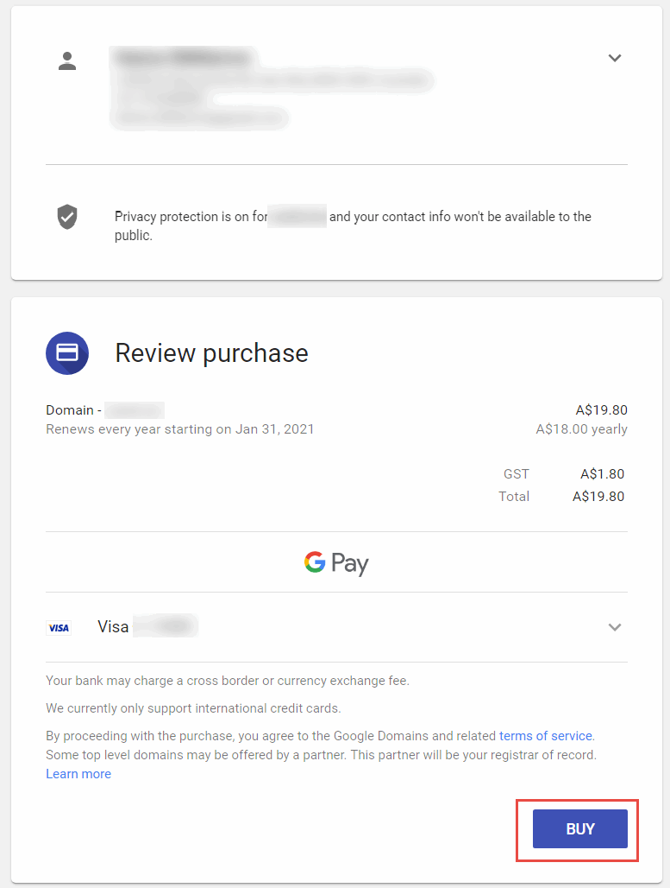{ width=450 }

Once purchase is approved domain will be waiting for the approval from GoDaddy to complete the transfer.

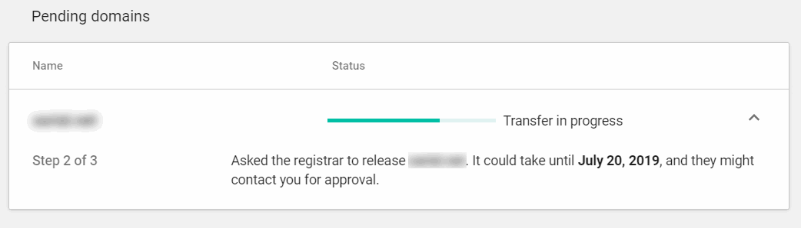

## Finalizing transfer

You will receive the e-mail from GoDaddy regarding the transfer which will be automatically completed within several business days. However it is possible to speed up the process and complete the transfer immediately.

To do this navigate to *View details* link in the pending out domain in the *My domains* section in GoDaddy web-site.

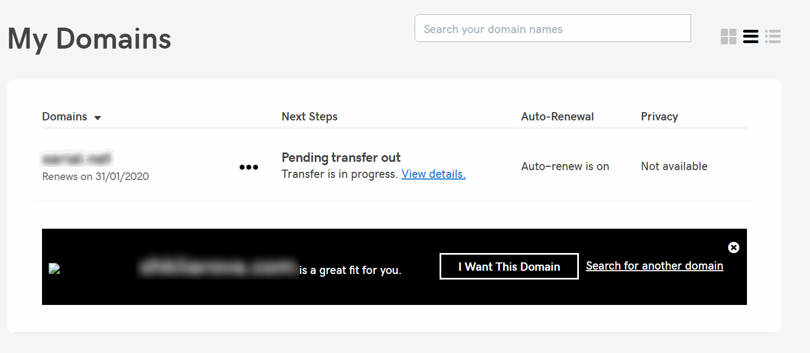

Click on *Accept or decline* link in the grid.

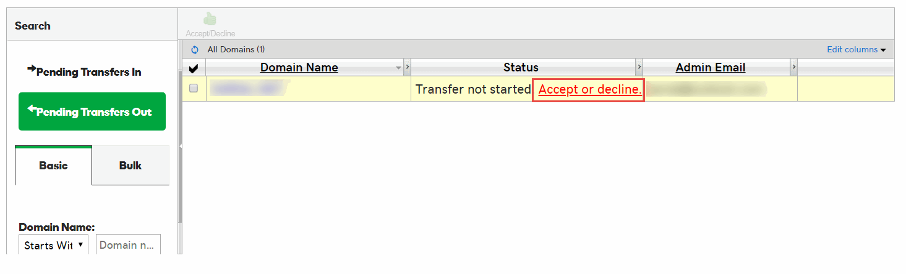

Select *Accept transfer* option and click *OK*

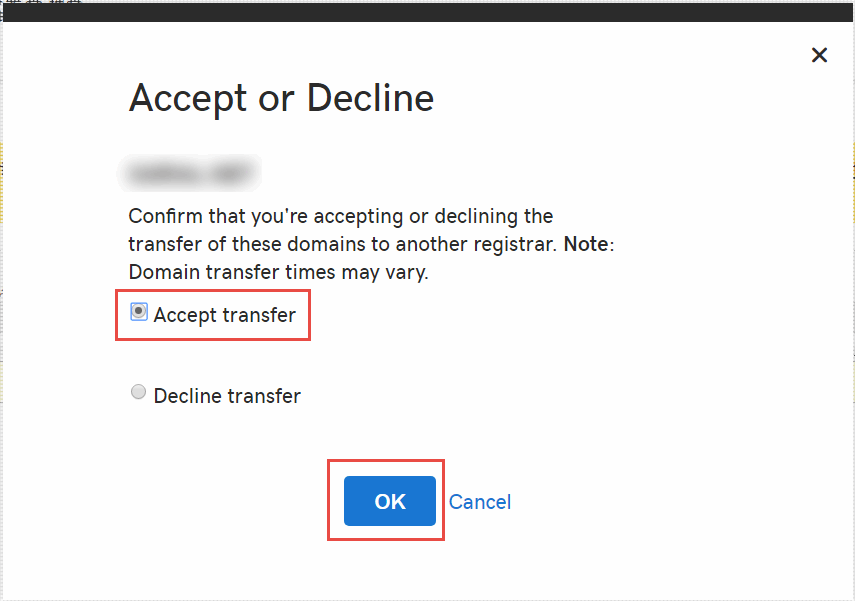{ width=450 }

The transfer will be completed in several minutes. Once done domain will be removed from GoDaddy console and will be shown in the Google Domains console.

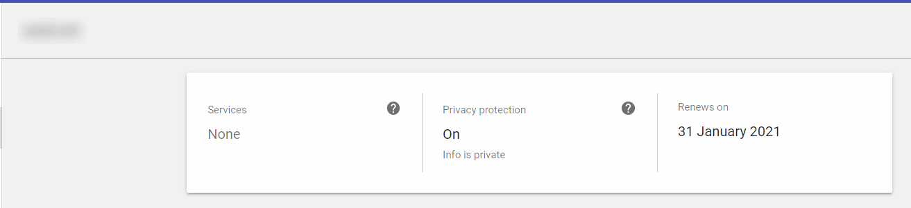
