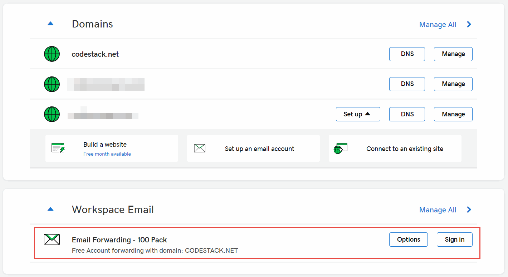
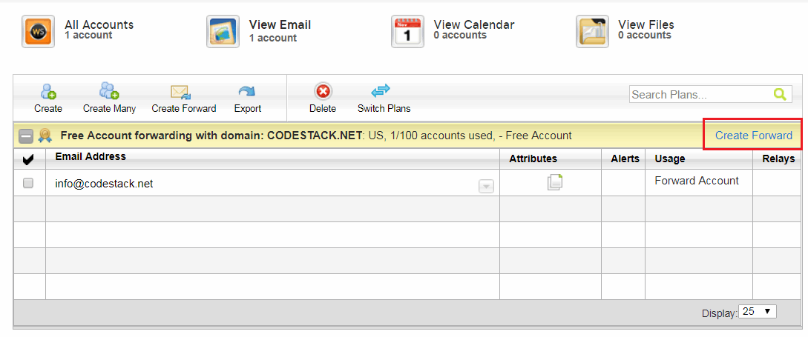
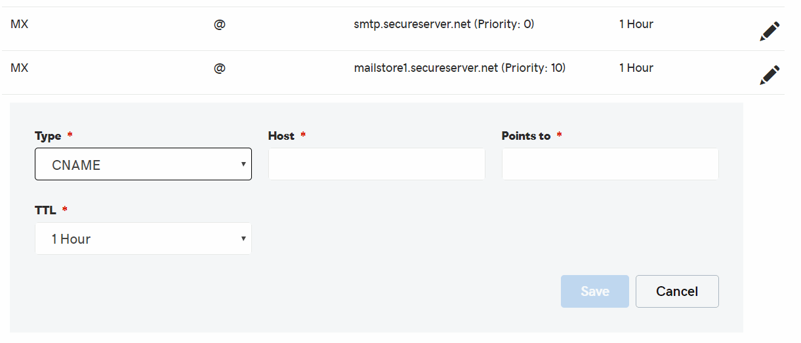
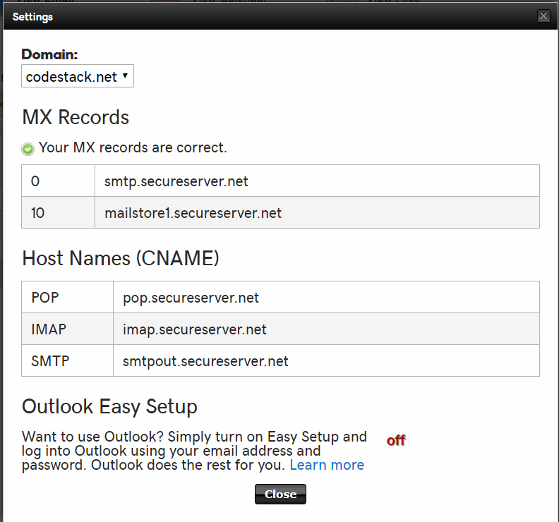
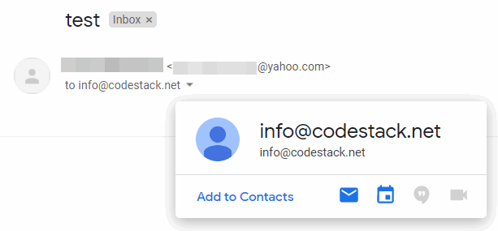
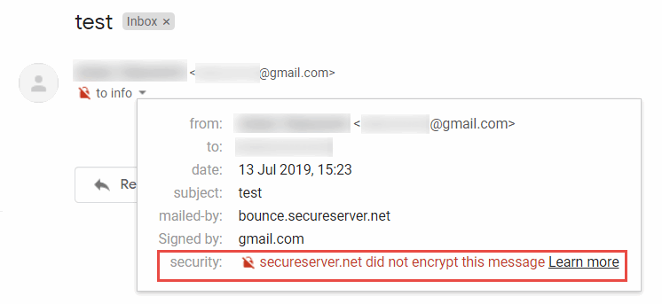

If you have a registered domain with GoDaddy you might want to setup e-mails to be send and received using the custom domain (e.g. info@domain.com).

GoDaddy provides the e-mail hosting service. The plan starts at 5$ per user per months.

GoDaddy also provides a free e-mail forwarding service for up to 100 e-mails. All e-mails sent to the specified e-mail will be redirected to the e-mail of your choice, including free emails (e.g. Gmail, Outlook, Yahoo etc.).

This is a detailed step-by-step guide of setting up e-mail forwarding with GoDaddy.

## Add Forwarding E-Mail

Select the *Manage All* link under the *Workspace Email* section in the GoDaddy console.

> You might need to activate this server by clicking *Redeem* button under the *Additional Products* section on the same page.

{ width=550 }

Click *Create Forward* link in the opened page.

{ width=550 }

Fill the *Forward Email* form. Specify the e-mail you want to forward from (i.e. e-mail with your custom domain). And e-mail you want to forward to (e.g. Gmail).

Specify other options if needed, such as capturing all e-mails sent to your domain.

{ width=450 }

## Configure DNS Records

Now it is required to configure the DNS record to enable forwarding.

Click on *DNS* button under the domain.

Add DNS records from the following table:

| Type  | Host | Points to                   | Priority | TTL    |
|-------|------|-----------------------------|----------|--------|
| MX    | @    | smtp.secureserver.net       | 0        | 1 Hour |
| MX    | @    | mailstore1.secureserver.net | 10       | 1 Hour |
| CNAME | pop  | pop.secureserver.net        | N/A      | 1 Hour |
| CNAME | imap | imap.secureserver.net       | N/A      | 1 Hour |
| CNAME | smtp | smtpout.secureserver.net    | N/A      | 1 Hour |

Validate that records are added correctly by activating the *Tools->Server Settings* menu command. The following dialog should be displayed.

{ width=350 }

## Receiving E-Mails

Now you can send e-mails from any e-mail address to your newly created e-mail (e.g. info@domain.com). The e-mail will be redirected to the specified e-mail box, while the *to* box will display the e-mail with custom domain.

There is however a limitation with GoDaddy e-mail forwarding as encryption is not supported and the *secureserver.net did not encrypt this message* warning is displayed for all forwarded e-mails:

Follow the [Setup Google Domains e-mail forwarding from custom domain for free](/hosting/email/googledomains-email-forwarding/) to setup similar free service with Google Domains which supports e-mails encryption and overcomes this limitation. You will need to [Transfer domain host from GoDaddy to Google Domains](/hosting/domain/transfer-godaddy-domain-to-googledomains/) to use this service.