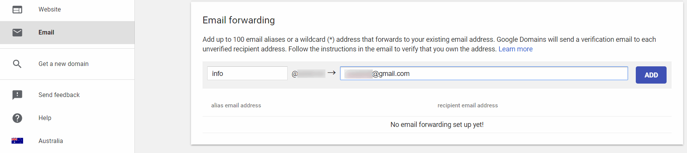
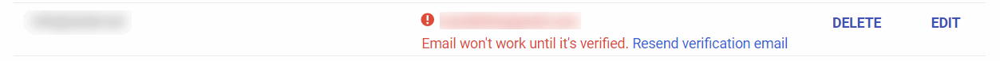
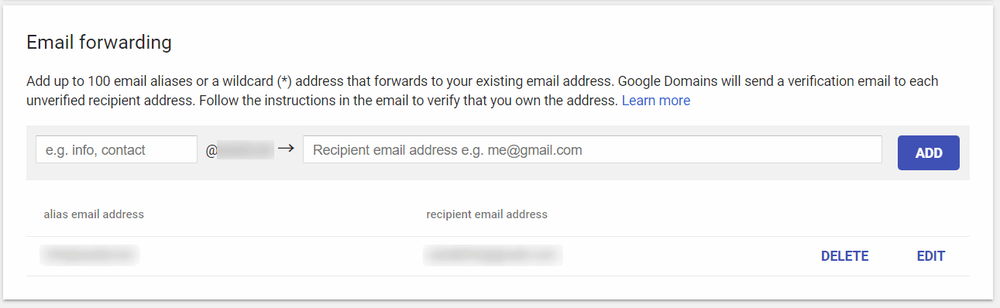
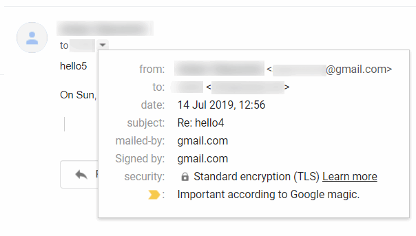

Google domains registrar provides a free service to forward up to 100 e-mails from the custom domains. To enable this service navigate to *Email* tab in the Google Domains Console.

Specify the e-mail to forward from the in the first box and e-mail to forward to in the second box.

verification code will be sent to the destination e-mail. Until the e-mail is verified the forwarding is not enabled:

Once e-mail is verified the warning is removed:

Unlike [forwarding with GoDaddy](/hosting/email/godaddy-email-forwarding/), Google Domains enables the encryption for the forwarded e-mails:

