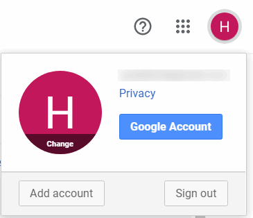
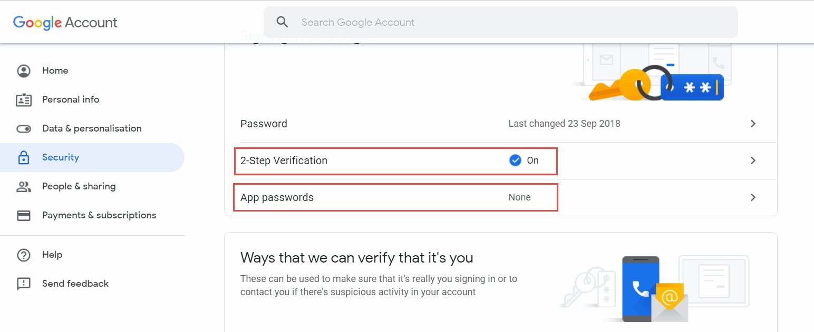
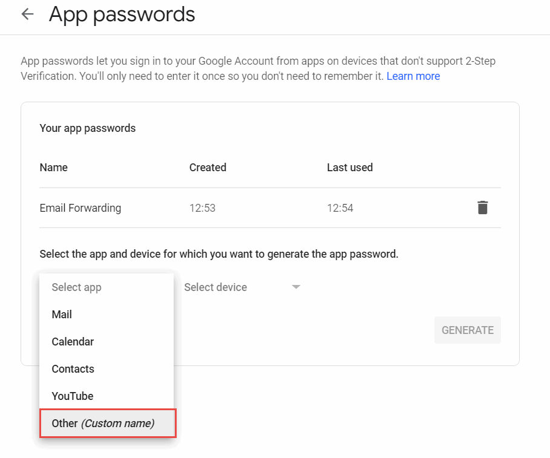
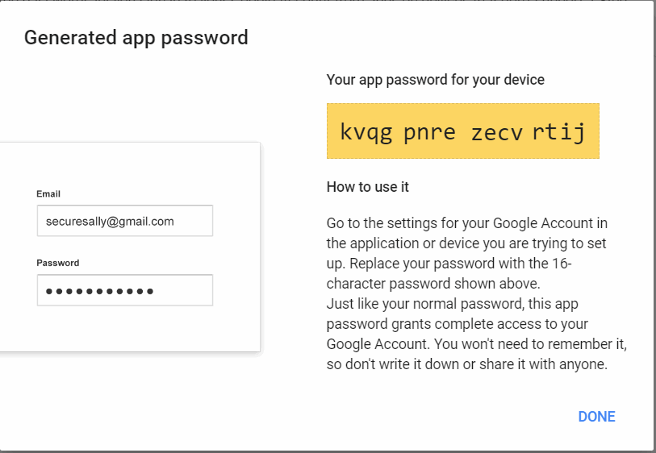
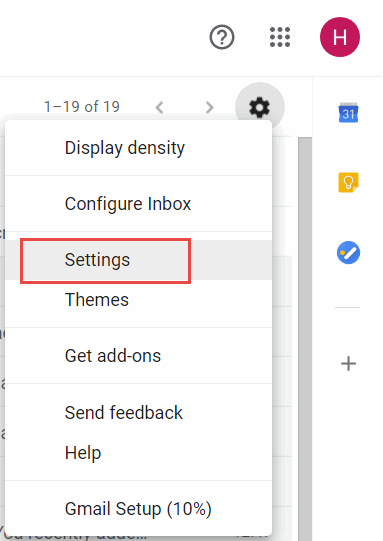
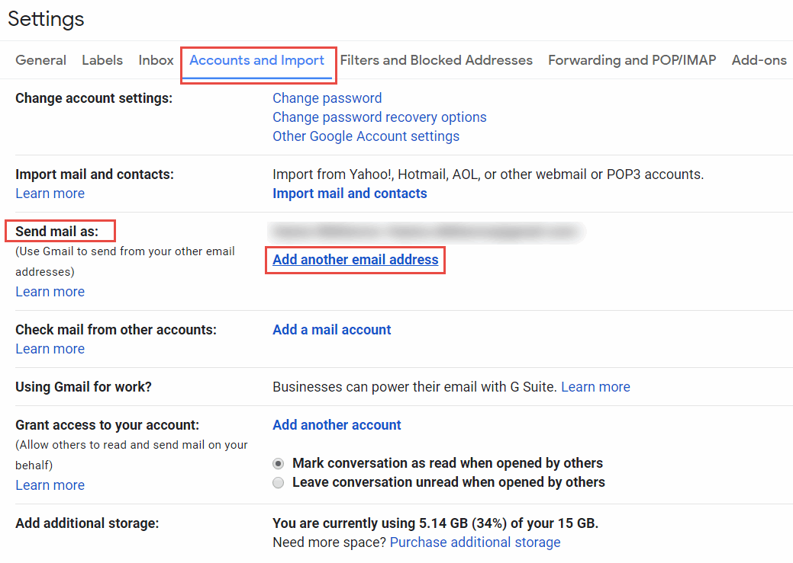
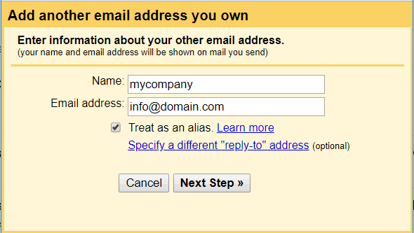
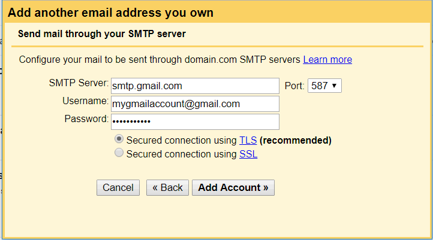
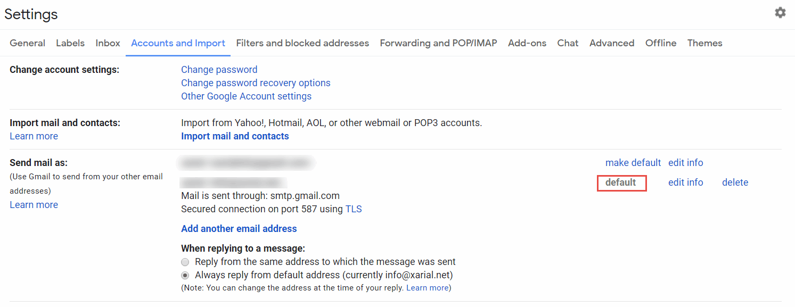

Gmail enables sending of e-mails with alias, which means that gmail can be sent on behalf of the custom domain setup with registrars such as [GoDaddy](https://godaddy.com) or [Google Domains](https://domains.google).

Below is a detailed step-by-step instruction of setting up the alias for sending e-mail as service without the need of using any additional 3rd party services.

## Setting up application

The first step for enabling the alias is setting up the 2-step verification and app passwords.

Navigate to Google Accounts.

{ width=250 }

Select the security tab and enable *2-Step Verification* option. Follow the guide to setup the settings.

Once finished select the *App passwords* option to create new application. Select *Other (custom name)* option from the *select app* drop-down box.

{ width=350 }

Click *Generate* button. As the result the password is generated for the app. Copy this password as it will be used in the next step.

{ width=350 }

## Setting up e-mail alias

Open the [e-mail page](https://mail.google.com) and select the *Settings* command from the drop-down.

{ width=350 }

Activate *Accounts and import* tab.

Locate *Send mail as* section and click *Add another e-mail address* link.

Specify the information about the other e-mail (i.e. the one you are creating alias for).

{ width=450 }

Configure the smtp server. Set the value of *SMTP server* to *smtp.gmail.com*. User name is your gmail user name (not the custom domain name, i.e. the currently logged in user to gmail). Password is an app password generated in the previous step (not the gmail password).

{ width=450 }

As an optional step set the created alias as default option so e-mails will be sent using the alias by default.

Now you can send e-mails with an alias and it will appear as e-mail with custom domain to the receiver instead of the @gmail.com e-mail.
