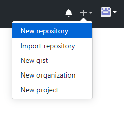
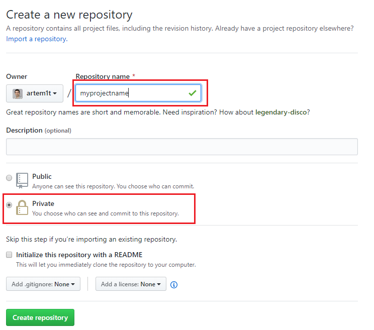
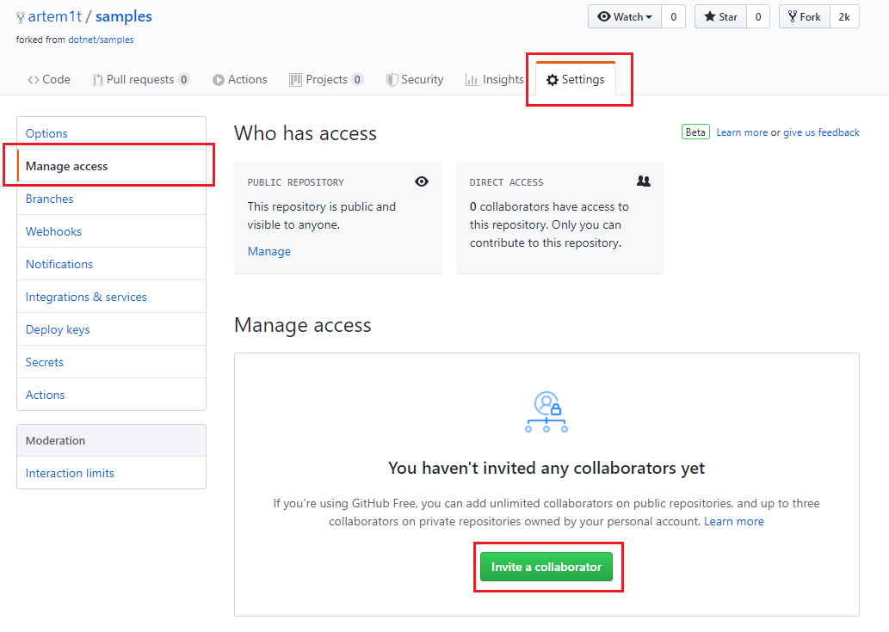
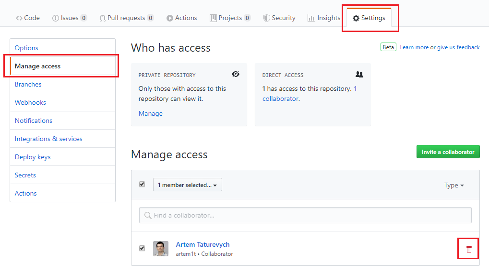

Below are the steps to setup a repository on [GitHub](https://github.com/) and provide an access to the 3rd party developers:

## Creating New Account

* Navigate to [https://github.com/](https://github.com/) and click **Sign up**

* Enter the registration details

* Select plan. Check the features of **Free** plan as this might be sufficient for the scope of your project, but you can also explore other options if necessarily.

* Verify the account as required

* Create new repository:

* Specify the name of the repository. Select **Private** option for repository visibility to make it only visible for the owner, otherwise it will be visible for everyone:

## Add Collaborators To The Project:

* Click on repository
* Go to **Settings** tab
* Select **Manage access** from the list on the left hand side
* Click **Invite a collaborator** button
* Search for user id to provide access to the repository

* You can remove collaborator once the project is completed:

