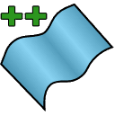

Geometry++ is a SOLIDWORKS add-in extending the functionality related to geometry creation and manipulation. Add-in is fully integrated into SOLIDWORKS and provides same look and feel of additional features as any other built-in features. All feature preserve parametric behavior and automatically regenerated when required.

Refer [Installation](installation) page for more information and download link.

Source code is available at [GitHub](https://github.com/codestackdev/geometry-plus-plus)

## Features

### Convert Solid To Surface

This command converts solid bodies to surface bodies. Multiple input bodies can be converted within one feature.

### Crop Bodies

This command allows cropping surface and solid (target bodies) using sketches or sketch regions (trimming tools).

### Extrude Surface With Caps

This command allows extruding the surface and adding the caps at the ends of extrusion.

### Bodies Fillet

This command allows adding the fillet to entire bodies, faces, edges and vertices supporting multiple bodies within a single feature

### Split Body By Faces

This command allows creating of surface (sheet) bodies from all the faces of input solid or surface bodies.

## Performance

This command allows to temporary suspend the rebuild operation in SOLIDWORKS parts, assemblies and drawings allowing to combine multiple rebuild operations into one operation to reduce the rebuild time.