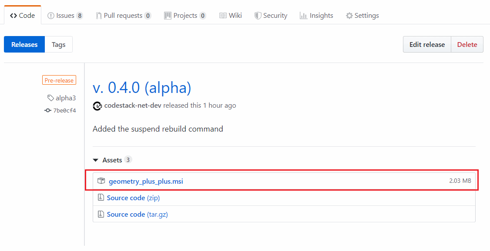
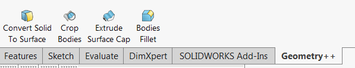

To install add-in download the latest msi-installer (*geometry_plus_plus.msi*) at [this link v. 0.4.0 (alpha 3)](https://github.com/codestackdev/geometry-plus-plus/releases/tag/alpha3).

{ width=550 }

Once installer restart SOLIDWORKS (if it was already started). New *Geometry++* group is added to SOLIDWORKS menu, toolbar and command manager box.

Add-in checks for the update on startup. If new update is available popup message with download link is displayed.

Add-in can be uninstalled from the Add or Remove Programs group in Control Panel.