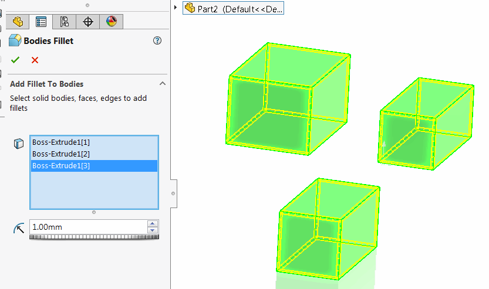
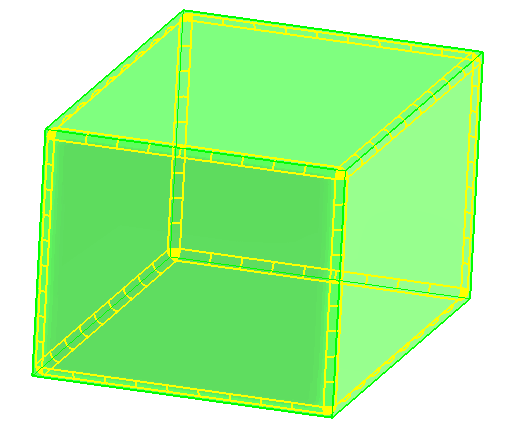
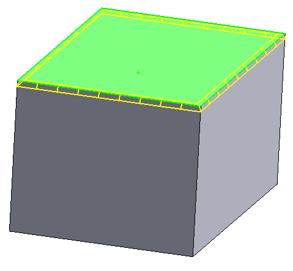
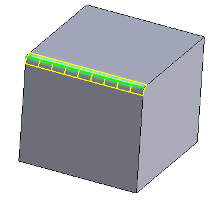
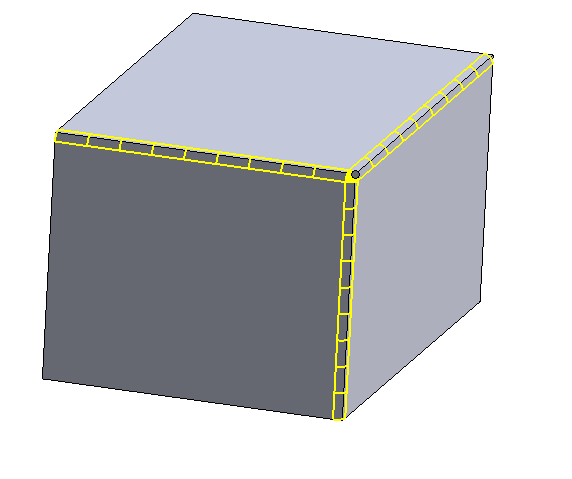

This commands allows adding the simple fillet to bodies, faces and edges. This command supports multi-bodies which means that single feature can be used to add fillets to different bodies.

{ width=250 }

### Adding fillet to bodies

{ width=250 }

Select the entire body from either from the feature tree or using the selection filter. Fillet will be added to each edge of the body.

### Adding fillet to faces

{ width=250 }

Select face or faces to add fillet to. Fillet is added to all edges of this face

### Adding fillet to edges

{ width=250 }

Select edge or edges to add fillet to.

### Adding fillet to vertices

{ width=250 }

Select vertex or vertices to add fillet to. Fillet is added to all connected edges of this vertex.
