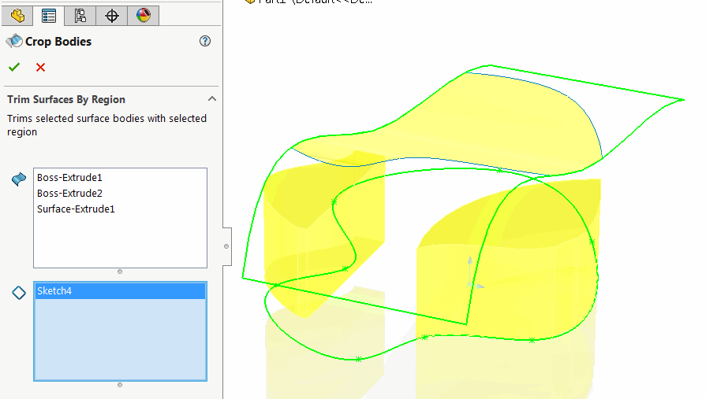
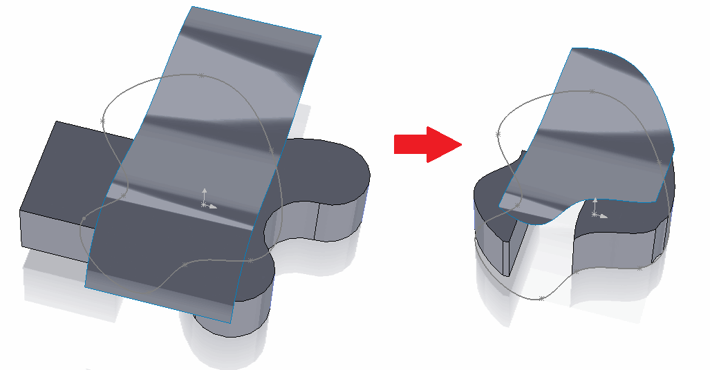
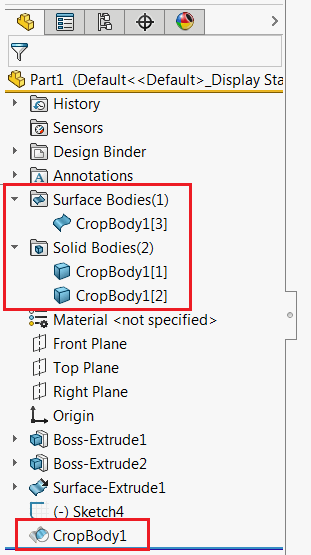

This command allows trimming surface or solid (target bodies) using sketches or sketch regions (trimming tools).

Multiple target bodies and trimming tools are supported.

* Select surface or solid body or bodies from the graphics area or from the feature tree. Box selection is supported
* Select sketches or sketch regions (requires setting of solid works filter) to trim the surface. Tool will keep the surface geometry which resides within the sketch region.
Feature will trim the surface perpendicular to the corresponding trim tool sketches normals.

{ width=500 }

Once selection completed and green tick is clicked new feature is added to the feature manager tree.

{ width=500 }

Original bodies are acquired by new feature. The bodies outside of the region will be removed by macro feature.

{ width=300 }

Feature can be edited, removed and rollbacked as any other feature.
