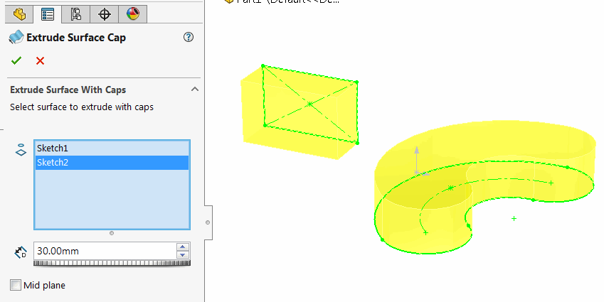
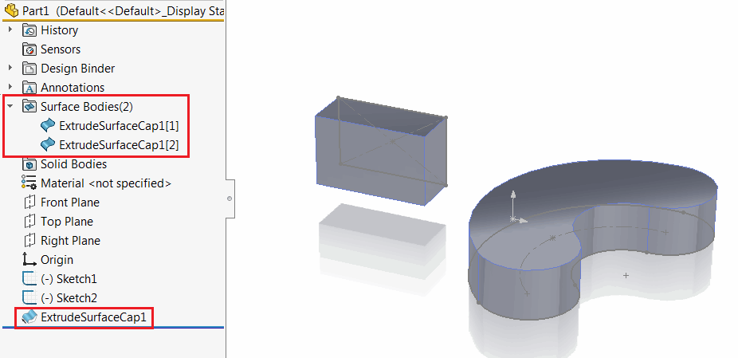
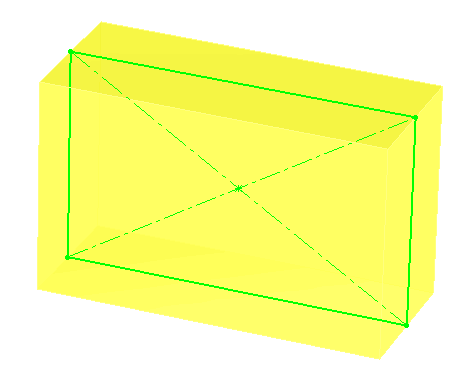

This command allows extruding the sketch or sketch contours to a surface automatically adding the caps at both ends of the extrusion without converting the result to a solid and keeping it as a surface body.

{ width=250 }

Multiple sketches can be selected within single feature.

{ width=450 }

Mid plane option allows to extrude the feature in both directions

{ width=250 }
