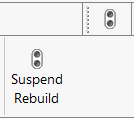
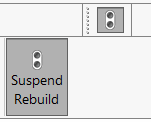
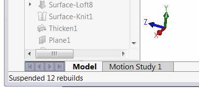



This command allows to temporary suspend rebuild operation while still allowing to modify the dimensions, sketches and feature definitions.

This approach allows to greatly reduce the modelling time by execution rebuild operations in a batch mode.

Command is available in menu, toolbar and command manager tab and acts as a toggle button.

When button is not toggled the suspend rebuild mode is disabled and rebuild operations are performed normally.

When the button is toggled all rebuild operations are suspended.

The status bar displays the information about the number of currently suspended rebuild operations.

In suspend rebuild mode the changes are not resolved and model will remain unchanged. When editing the definitions of the features and closing the Property Manager Page all the features below the edited feature become disabled (not editable) until model is rebuild.

Once batch editing completed disable the *Suspend Rebuild* button and click *Rebuild (ctrl+B)* or *Regenerate (ctrl+Q)* command to update the model.

> Disclaimer: Although the functionality of suspend rebuild is implemented using the SOLIDWORKS API, suppressed rebuild may cause unexpected behaviour of the model. However there were no reported issues of any damage or corruption. Use on your own risk.
