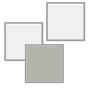

MyToolbar is a SOLIDWORKS add-in which allows creating new toolbars within SOLIDWORKS for hosting custom commands (either macro buttons or any existing SOLIDWORKS commands).

MyToolbar is an open-source project hosted on [GitHub](https://github.com/codestackdev/my-toolbar).

Follow the [Installation Guide](/labs/solidworks/my-toolbar/installation) for the download link and the setup instructions.

Follow the [User Guide](/labs/solidworks/my-toolbar/user-guide) for technical documentation of the product.

You can report bugs or request enhancements on the [Issues](/labs/solidworks/my-toolbar/issues) page

