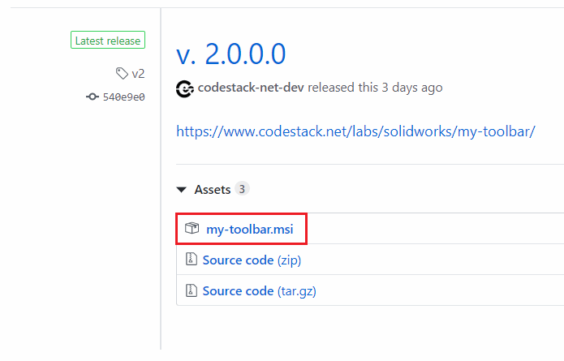
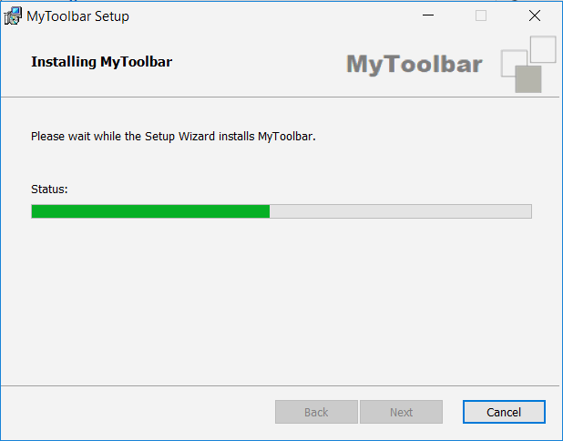
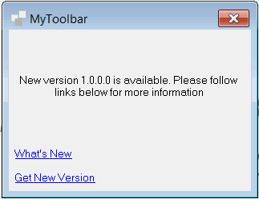
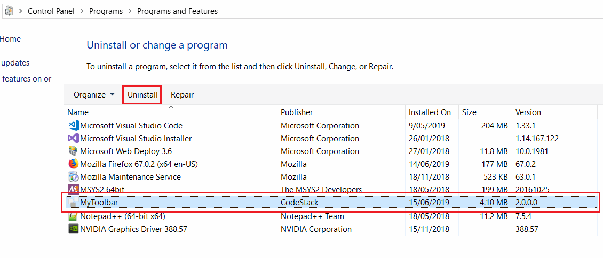

### Download

Latest version of the add-in can be downloaded from this link: [Version 2.2 (Beta)](https://github.com/codestackdev/my-toolbar/releases/tag/v2.2).

Download the *my-toolbar.msi* installer file.

{ width=450 }

### Installation

* Run downloaded *my-toolbar.msi* installer file
* Follow the installation wizard
* Start SOLIDWORKS

{ width=350 }

### Updates

Every time add-in starts it checks if there any updates available on the server. If new version is available the following message is displayed:

It is possible to see what's new features have been added or download new version by following the corresponding links.

### Deinstallation

* Close SOLIDWORKS
* Navigate to Windows Control Panel (*Control Panel\Programs\Programs and Features*) and locate *MyToolbar* application. Click uninstall

{ width=550 }
