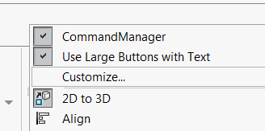
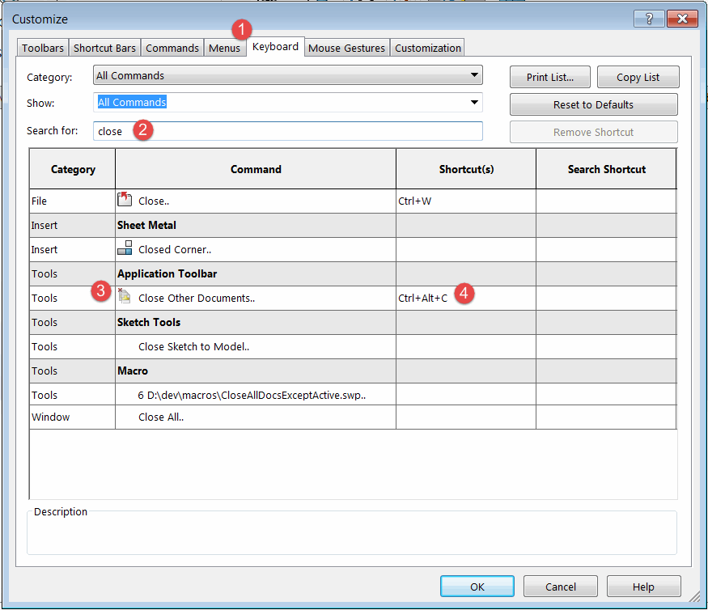
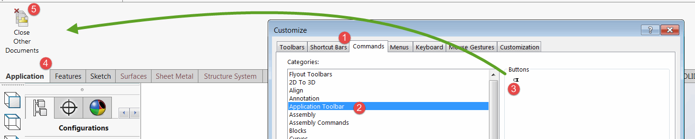

Commands created with MyToolbar can be additionally customized using SOLIDWORKS functionality.

Navigate to *Customize...* menu in SOLIDWORKS by clicking on the empty space in toolbar or command manager area in SOLIDWORKS application.

{ width=250 }

## Assigning shortcuts to commands

To assign shortcut navigate to *Keyboard* tab and search for the command from MyToolbar (either select the toolbar from the drop-down menus or type command name):

{ width=550 }

Click on the *Shortcut(s)* cell and assign the key combination.

## Adding commands to command manager tab boxes

Commands created with MyToolbar can be hosted on any other toolbar or command tab boxes. 

Navigate to the toolbar in the *Commands* tab of the *Customize* dialog.

Drag-n-drop the required command into the SOLIDWORKS toolbar area (other toolbar or command tab box)

> Due to current limitation, the commands are not rendered properly in the *Buttons* area as shown on the picture below. But still can be dragged onto the toolbar and will function as normal.