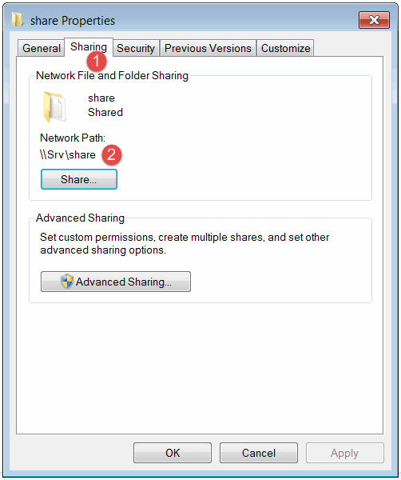
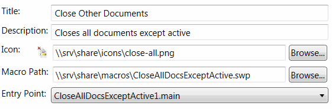
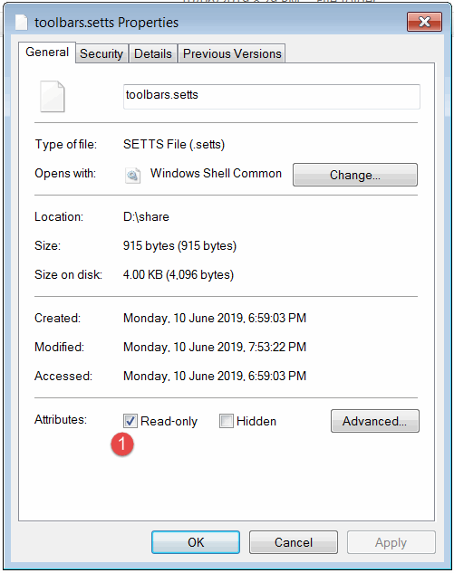
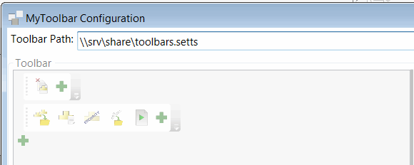

MyToolbar supports sharing of the toolbar configuration with multiple users.

MyToolbar configuration and all macros and icons can be placed in the shared folder to enable multi-user environment. In this case the changes in the macros or toolbar configuration will be propagated to all users.

Create a shared folder which will host the configuration and macros. This folder should be created on a server machine by the administrator and all users which will use the toolbar should have a read-only (or read-write) access to this folder. Copy all macros and icons to this folder.

{ width=450 }

1. Sharing property of the folder in the Windows File Explorer
1. UNC path of the shared folder

Relink the paths to the icons and macros to use UNC location instead of the local path. This will ensure that other users will be able to utilize the configuration.

{ width=550 }

In most cases it is required to allow the editing of configuration by administrator only. MyToolbar supports a read-only mode. Either assign the read-only attribute to the *toolbar.setts* file or configure the required permissions.

{ width=450 }

MyToolbar will check these options and load the toolbar as read-only if corresponding settings are set.

Users which are required to access the toolbar should select the toolbar path from the shared location as shown below. This setting is only required to be set once and will be maintained.

{ width=550 }