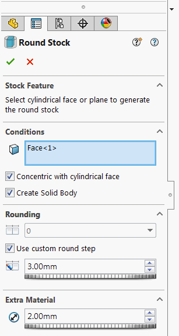

{ width=350 }

This add-in allows generating round stock feature around the selected solid body.

User can select either circular face or plane to specify the direction of the stock.

If circular face is selected than its axis is used as direction. It is also possible to specify the option to make the round stock concentric to the selected circular face.

Feature can optionally generate the body to represent the round stock.

Feature is fully parametric and will update automatically once the reference geometry is changed.

Feature writes the values to the configuration specific custom properties.

Add-in can be downloaded from [this link v. 0.5.0 (beta 1)](https://github.com/codestackdev/stock-fit-geometry/releases/tag/beta1).

Source code is available at [GitHub](https://github.com/codestackdev/stock-fit-geometry)

## Demonstration Video (outdated)

<video style="width: 100%;height: auto" controls>
  <source src="/labs/solidworks/stock-fit-geometry/stock-fit-geometry-preview-demo.mp4" type="video/mp4">
  Your browser does not support HTML5 video.
</video>

