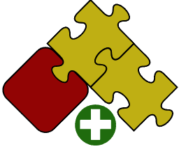

SwEx.AddIn provides utilities for simplified development of SOLIDWORKS add-ins.

The functionality includes

* Automatic registration of the add-in
* Simplified commands groups management
* Events management (future versions)
* Task Panes, Feature Manager Tab, Model View Tab (future versions)

Source code is available on [GitHub](https://github.com/codestackdev/swex-addin)

## Features

### Registering Add-In

To Register add-in just add the AutoRegister attribute (no need to run custom regasm commands, no need to call any static classes)

{#% include code-tabs.html src="Overview.Register" %}

### Adding Commands

Commands can be defined by creating an enumerations. Commands can be customized by adding attributes to assign title, tooltip, icon etc. Commands can be grouped under sub menus. Simply specify the image (transparency is supported) and framework will create required bitmaps compatible with SOLIDWORKS. No need to assign gray background to enable transparency, no need to scale images to fit the required sizes - simply use any image and framework will do the rest. Use resources to localize the add-in.

{#% include code-tabs.html src="Overview.CommandGroup" %}

### Managing Documents Lifecycle and Events

Framework will manage the lifecycle of documents by wrapping them in the specified class and allows to handle common events:

{#% include code-tabs.html src="Overview.DocHandler" %}

### Reading and Writing to 3rd Party Storage and Store

It has never been easier to read and write data to the internal SOLIDWORKS file storage. Simply override the corresponding event and serialize/deserialize the data using XML, DataContract, Binary etc. serializers:

{#% include code-tabs.html src="Overview.3rdParty" %}

### Hosting User Controls In SOLIDWORKS Panels

Just specify User Control to host and framework will do the rest:

#### Task Pane

{#% include code-tabs.html src="Overview.TaskPane" %}

## Video Tutorials

### Introduction



### Detailed Guide

