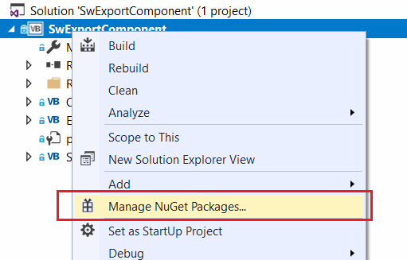
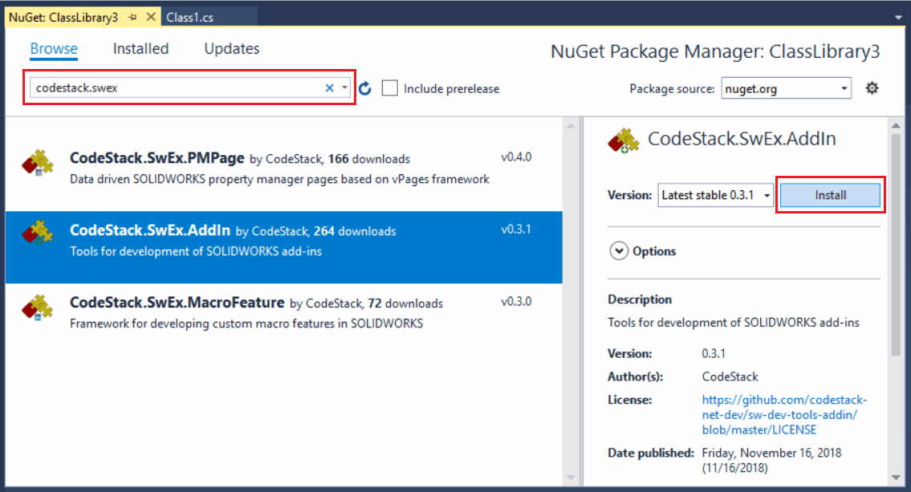
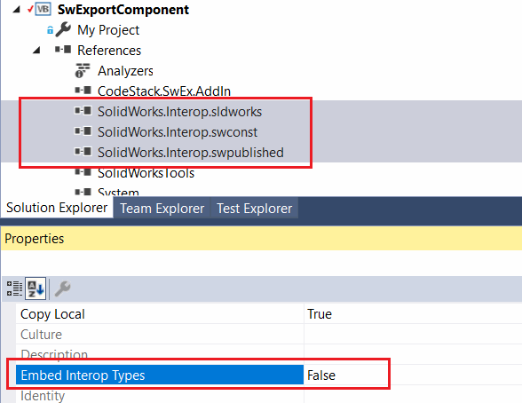
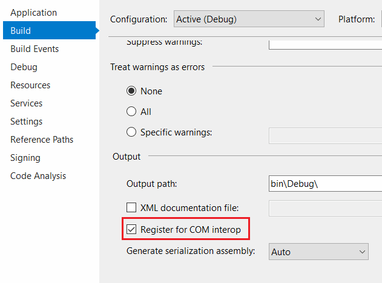
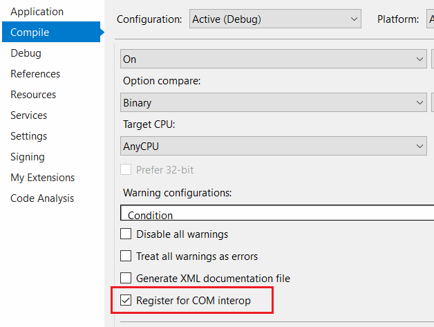
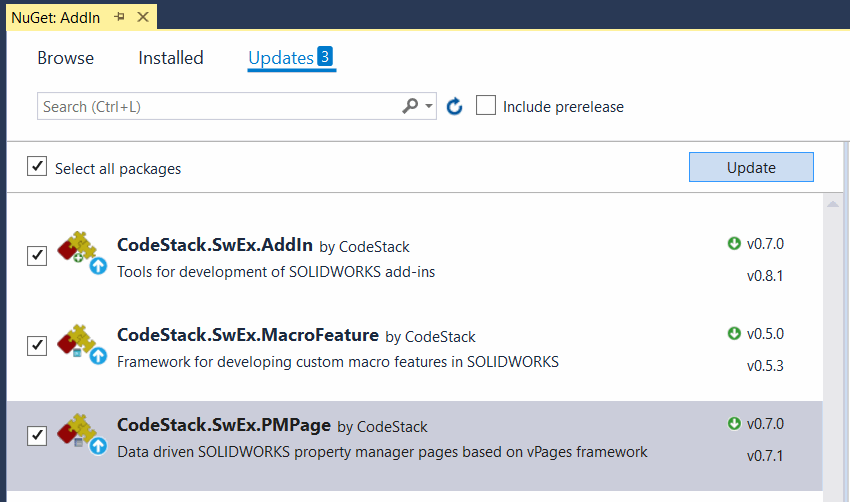
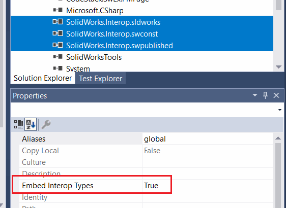

## Installing NuGet package

Select *Manage NuGet Packages...* command from the context menu of the project in Visual Studio

{ width=250 }

Search for *CodeStack.SwEx* in the search box. Once found click *Install* button for the required framework.

This will install all required libraries to the project.

## Preparing the project

Set the *Embed Interop Types* to *False* for the SOLIDWORKS Interop libraries as shown below.

{ width=300 }

Check the *Register for COM Interop* option in project properties:

For C# project this option can be found in *Build* tab:

{ width=300 }

For VB.NET project this option can be found in *Compile* tab:

{ width=300 }

## Updates

SwEx framework is actively developing and new features and bug fixes released very often. 

Nuget provides very simple way of upgrading the library versions. Simply navigate to Nuget Package manager and check for updates:

In order to see the release notes, follow the links below for the corresponding library.

* [SwEx.AddIn Release Notes](https://docs.codestack.net/swex/add-in/html/version-history.htm)
* [SwEx.PMPage Release Notes](https://docs.codestack.net/swex/pmpage/html/version-history.htm)
* [SwEx.MacroFeature Release Notes](https://docs.codestack.net/swex/macro-feature/html/version-history.htm)

In some cases updating the libraries may reset the *Embed Interop Types* option to *True* for SOLIDWORKS interop assemblies.

{ width=350 }

It is recommended to set it back to *False*.

## Supporting multiple versions of the SwEx framework

Methods signatures and behaviour of SwEx framework might change in new versions. SwEx libraries are strong named which prevents the compatibility conflict in case several add-ins loaded in the same session of SOLIDWORKS referencing different versions of framework.