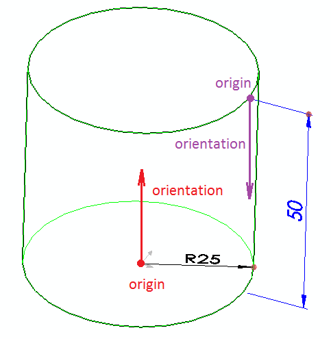

Dimensions is an additional source of input for macro feature. Dimensions can be defined in the following way:



It is required to arrange the dimensions after rebuild by overriding the [OnSetDimensions](https://docs.codestack.net/swex/macro-feature/html/M_CodeStack_SwEx_MacroFeature_MacroFeatureEx_1_OnSetDimensions.htm) method. Use [DimensionData::SetOrientation](https://docs.codestack.net/swex/macro-feature/html/M_CodeStack_SwEx_MacroFeature_Data_DimensionDataExtension_SetOrientation.htm) helper method to align the dimension.



*Origin* is a starting point of the dimension.

For linear dimensions *orientation* represents the vector along the direction of the dimension (i.e. the direction of measured entity)
For radial dimensions *orientation* represents the normal of the dimension (i.e. the vector of rotation of the dimension)

{ width=350 }

### Passing data from regeneration

In some cases it might be required to pass the data from [OnRebuild](https://docs.codestack.net/swex/macro-feature/html/M_CodeStack_SwEx_MacroFeature_MacroFeatureEx_1_OnRebuild.htm) method to be used within the [OnSetDimensions](https://docs.codestack.net/swex/macro-feature/html/M_CodeStack_SwEx_MacroFeature_MacroFeatureEx_1_OnSetDimensions.htm). For example when the geometry is required to calculate the dimension position.

This could be possible by creating custom rebuild result and returning from the regeneration function.

