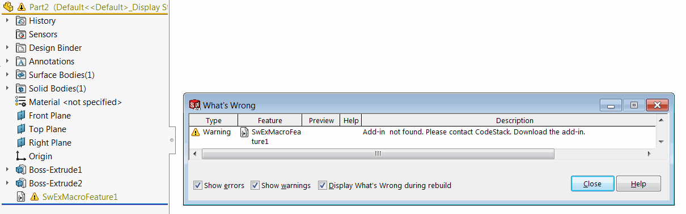

Framework provides 3 main macro feature abstract classes which reside in the [CodeStack.SwEx.MacroFeature](https://docs.codestack.net/swex/macro-feature/html/N_CodeStack_SwEx_MacroFeature.htm) namespace to be inherited in order to register new macro feature.

* [MacroFeatureEx](https://docs.codestack.net/swex/macro-feature/html/T_CodeStack_SwEx_MacroFeature_MacroFeatureEx.htm) - simple macro feature. Macro feature doesn't require any parameters and will performa a simle operation
* [MacroFeatureEx{TParams}](https://docs.codestack.net/swex/macro-feature/html/T_CodeStack_SwEx_MacroFeature_MacroFeatureEx_1.htm) parameters driven macro feature. All of the required inputs can be defined within the *TParams* structure (data model). [Macro feature data](\labs\solidworks\swex\macro-feature\data) includes
    * Field Values (Named parameters)
    * Dimensions
    * Selections
    * Edit Bodies
* [MacroFeatureEx{TParams,THandler}](https://docs.codestack.net/swex/macro-feature/html/T_CodeStack_SwEx_MacroFeature_MacroFeatureEx_2.htm) - parameters driven macro feature with ability to assign the handler per feature to track the lifecycle.

Macro feature class must be com visible.

It is recommended to explicitly assign guid and prog id for the macro feature.



## Icon

Custom macro feature icon can be assigned via [IconAttribute](https://docs.codestack.net/swex/macro-feature/html/T_CodeStack_SwEx_MacroFeature_Attributes_IconAttribute.htm). Icon can be loaded from the resources and supports transparency. By defaul icon files will be created in the %ProgramData%\CodeStack\{MacroFeatureId}\Icons folder, hovever this location can be changed by specifying this in the *iconFolderName* parameter.

## Options

Additional options can be assigned via [OptionsAttribute](https://docs.codestack.net/swex/macro-feature/html/T_CodeStack_SwEx_MacroFeature_Attributes_OptionsAttribute.htm) and 

Macro feature is a COM object which means it needs to be registered in order for maco feature to operate. Macro feature is strored within the model, but if model is opened in the environment where the Macro Feature COM object is not registered - rebuild error will be displayed. Furthermore this 'dangling' macro feature cannot be removed or suppressed.

User can specify the custom message to be displayed in the *What's Wrong* dialog via *provider* parameter of [OptionsAttribute](https://docs.codestack.net/swex/macro-feature/html/T_CodeStack_SwEx_MacroFeature_Attributes_OptionsAttribute.htm). Specified message will be displayedafter the predefined *Add-in not found. Please contact*



{ width=650 }

To insert the macro feature use the extension method: [IFeatureManager::InsertComFeature](https://docs.codestack.net/swex/macro-feature/html/M_SolidWorks_Interop_sldworks_FeatureManagerEx_InsertComFeature__2.htm).