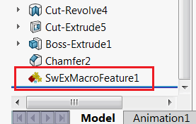

SwEx.MacroFeature provides utilities for simplified development of SOLIDWORKS macro features based on the data model.



Source code is available on [GitHub](https://github.com/codestackdev/swex-macrofeature)

## What is macro feature?

Macro feature is a custom element which could be added into Feature Manager Design tree using SOLIDWORKS API. This element will behave in exactly the same way as any other standard feature (e.g. Boss-Extrude, Move-Copy Body, Mate, etc.)

{ width=250 }

Macro feature supports parametric nature of SOLIDWORKS and could regenerate if any of the parents changed.

Macro feature provides 3 main handlers

* Regeneration - called when feature is rebuilt (either as a result of model force rebuild operation or as a result of the updated of any of the dependencies). Macro feature can create new body or bodies or be only a metadata element.
* Edit - called when feature definition is requested to be edited by the user
* State update - called every time state is updated (i.e. feature is selected, refreshed etc.)

Macro feature can store additional metadata parameters (including dimensions and selection references).