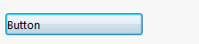

In order to create a button in the property manager page, it is required to declare the property of delegate type [Action](https://docs.microsoft.com/en-us/dotnet/api/system.action?view=netframework-4.8).

The pointer to void function assigned to this property is a handler of the button:

{#% include code-tabs.html src="Button" %}
