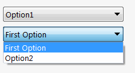

Combo box control will be automatically generated for all the properties of enumerator types. All values of enumerators will be considered as the items in the combo box:



Additional options and style for combo box control can be specified via [ComboBoxOptionsAttribute](https://docs.codestack.net/swex/pmpage/html/T_CodeStack_SwEx_PMPage_Attributes_ComboBoxOptionsAttribute.htm)

### Item Text
[ComboBoxItemTextAttribute](https://docs.codestack.net/swex/pmpage/html/T_CodeStack_SwEx_PMPage_Attributes_ComboBoxItemTextAttribute.htm) attribute can be used to specify user friendly title for the items to be shown in the combo box

