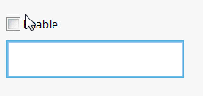
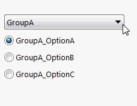

It might be required to develop responsive property manager pages whose controls state depending on other control values, e.g. [controls enable state](#controls-enable-state), [cascading lists](#cascading-lists), etc. SwEx framework provides easy to setup and use functionality to implement these requirements and allows to update the states dynamically.

In order to define the controls which will be used for dependencies, it is required to assign the tags. Control tags allow to track the controls created from the data model properties. Tags can be assigned via [ControlTagAttribute](https://docs.codestack.net/swex/pmpage/html/T_CodeStack_SwEx_PMPage_Attributes_ControlTagAttribute.htm) decorated on data model properties. Control tag can be represented as any type, it is recommended to use enumerations or strings as tags.

Handler class must inherit [DependencyHandler](https://docs.codestack.net/swex/pmpage/html/T_CodeStack_SwEx_PMPage_Base_DependencyHandler.htm) class and [UpdateControlState](https://docs.codestack.net/swex/pmpage/html/M_CodeStack_SwEx_PMPage_Base_DependencyHandler_UpdateControlState.htm) method will be called every time when state needs to be resolved (i.e. the value of the parent control is changed).

Please see below couple of examples for using this technique to develop responsive property pages. It is possible to implement any custom logic and provide multiple parent controls if needed.

## Controls Enable State

Below is a code example demonstrating how to disable/enable selection box control based on the value of the check-box.



## Cascading Lists

Below code example demonstrates how to implement cascading list.

Each value in the dropdown (defined via Enum) has its own nested list of options (also defined by another Enums). Once the value of the drp-down changed the visibility of option groups is changed as well.


