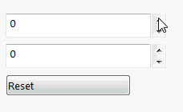

In order to update control values for the properties changed from the code behind dynamically (e.g. on button click or when one property is changing another property), it is required to implement the [INotifyPropertyChanged](https://docs.microsoft.com/en-us/dotnet/api/system.componentmodel.inotifypropertychanged?view=netframework-4.8) in the data model. Raise the [PropertyChanged](https://docs.microsoft.com/en-us/dotnet/api/system.componentmodel.inotifypropertychanged.propertychanged?view=netframework-4.8) event for every property which needs to be watched to notify the environment that value has changed and control needs to be updated.


