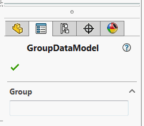

Group box will be automatically created for all complex types in the data model



> SOLIDWORKS doesn't support groups nested into other groups, so all the nested complex types will be added as the groups to the main property manager page.
