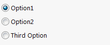

Options group can be defined by decorating the property of type Enum with [OptionBoxAttribute](https://docs.codestack.net/swex/pmpage/html/T_CodeStack_SwEx_PMPage_Attributes_OptionBoxAttribute.htm).

{#% include code-tabs.html src="OptionBox" %}
