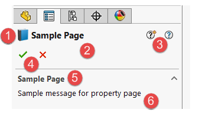
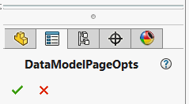
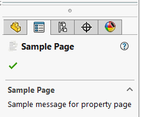
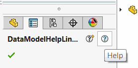

1. Icon of the property manager page
1. Title of the property manager page
1. Links to documentation (what's new and help)
1. Control buttons (OK and Cancel)
1. Optional user message title
1. Optional user message content

Property manager page style can be customized by applying the [PageOptionsAttribute](https://docs.codestack.net/swex/pmpage/html/T_CodeStack_SwEx_PMPage_Attributes_PageOptionsAttribute.htm) onto the main class of the data model.



Attributes allow to customize the buttons and behaviour of the page

## Attribution

Page title can be assigned via [DisplayNameAttribute](https://docs.microsoft.com/en-us/dotnet/api/system.componentmodel.displaynameattribute?view=netframework-4.7.2)

Icon can be set via overloaded constructor of [PageOptionsAttribute](https://docs.codestack.net/swex/pmpage/html/M_CodeStack_SwEx_PMPage_Attributes_PageOptionsAttribute__ctor_1.htm)

Custom user message to provide additional information can be set via [MessageAttribute](https://docs.codestack.net/swex/pmpage/html/T_CodeStack_SwEx_PMPage_Attributes_MessageAttribute.htm)



## Help Links

[HelpAttribute](https://docs.codestack.net/swex/pmpage/html/T_CodeStack_SwEx_PMPage_Attributes_HelpAttribute.htm) allows providing links to help resources for your add-in. Framework will automatically open the specified url when user clicks corresponding help buttons in the property manager page:


