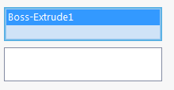
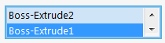

Selection box will be generated for the public properties decorated with [SelectionBoxAttribute](https://docs.codestack.net/swex/pmpage/html/T_CodeStack_SwEx_PMPage_Attributes_SelectionBoxAttribute.htm).

This attribute is applicable to the property of type object or any specific selectable type from 
[SolidWorks.Interop.SldWorks](http://help.solidworks.com/2014/english/api/SWHelp_List.html?id=a4a58f35c9bf4504aea25542315877d0#Pg0&ProductType=&ProductName=) namespace. In this case the type of the object should match the type specified in the [SelectionBoxAttribute](https://docs.codestack.net/swex/pmpage/html/T_CodeStack_SwEx_PMPage_Attributes_SelectionBoxAttribute.htm)



## Multiple Selection

This attribute is also applicable to lists. In this case multiple selections will be enabled for the selection box:



Additional selection box options can be specified via [SelectionBoxOptionsAttribute](https://docs.codestack.net/swex/pmpage/html/T_CodeStack_SwEx_PMPage_Attributes_SelectionBoxOptionsAttribute.htm)

## Selection Marks

Selection marks are used to differentiate the selection in the selection boxes. In most cases it is required for each selection to come into the specific selection box. In this case it is required to use different selection mark for every selection box. Selection marks are bitmasks, which means that they should be incremented with a power of two (i.e. 1, 2, 4, 8, 16 etc.) in order to be unique. By default SwEx framework will take care of assigning the correct selection marks when [this](https://docs.codestack.net/swex/pmpage/html/M_CodeStack_SwEx_PMPage_Attributes_SelectionBoxAttribute__ctor.htm) or [this](https://docs.codestack.net/swex/pmpage/html/M_CodeStack_SwEx_PMPage_Attributes_SelectionBoxAttribute__ctor_3.htm) version of constructor is used. However it is possible to manually assign the marks using [this](https://docs.codestack.net/swex/pmpage/html/M_CodeStack_SwEx_PMPage_Attributes_SelectionBoxAttribute__ctor_1.htm) and [this](https://docs.codestack.net/swex/pmpage/html/M_CodeStack_SwEx_PMPage_Attributes_SelectionBoxAttribute__ctor_2.htm) constructors.

## Custom selection filters

To provide custom filtering logic for selection box it is required to implement the filter by inheriting the [SelectionCustomFilter](https://docs.codestack.net/swex/pmpage/html/T_CodeStack_SwEx_PMPage_Base_SelectionCustomFilter_1.htm) class and assign the filter via overloaded constructor of [SelectionBoxAttribute](https://docs.codestack.net/swex/pmpage/html/M_CodeStack_SwEx_PMPage_Attributes_SelectionBoxAttribute__ctor_2.htm) attribute

