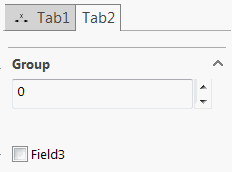

Tab containers are created for the complex types decorated with [TabAttribute](https://docs.codestack.net/swex/pmpage/html/T_CodeStack_SwEx_PMPage_Attributes_TabAttribute.htm).



## Tab with nested groups

Controls can be added directly to tabs or can reside in the nested groups:


