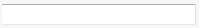

Text box control will be automatically generated for all properties of type *string*.



Additional options can be specified via [TextBoxOptionsAttribute](https://docs.codestack.net/swex/pmpage/html/T_CodeStack_SwEx_PMPage_Attributes_TextBoxOptionsAttribute.htm)
