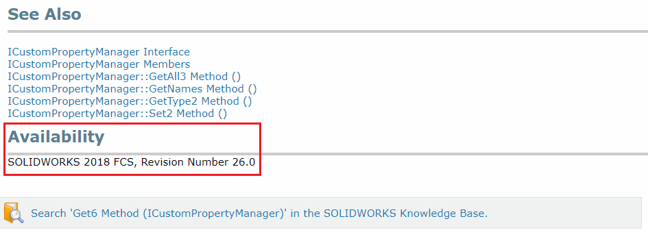

When SwEx.Framework library is installed via nuget package, SOLIDWORKS interop libraries are also installed. Framework referencing latest interop libraries in its project, allowing the users to use the latest versions of API with the newer versions of the SOLIDWORKS.

Despite latest interop is referenced, Framework is compatible with older versions of SOLIDWORKS. **Minimum supported version is SOLIDWORKS 2012**. In order to enable forward compatibility, but at the same time take a benefit of newer APIs in the newer SOLIDWORKS versions, framework implements fallback mechanism for the APIs it is using internally.  It means if the certain API used by framework is not available in the target version of SOLIDWORKS, older version of API is used.

It is recommended to use similar technique and implement fallback APIs if your add-in if it needs to target multiple versions of SOLIDWORKS. 

Availability of certain method can be found by exploring the corresponding section in the SOLIDWORKS API help documentation (both web and local version)

Use the [ISldWorks::IsVersionNewerOrEqual](https://docs.codestack.net/swex/common/html/M_SolidWorks_Interop_sldworks_SldWorksCommonEx_IsVersionNewerOrEqual.htm) extension method provided by framework to decide which API to use. For example the [ICustomPropertyManager::Get6](https://help.solidworks.com/2019/english/api/sldworksapi/SolidWorks.Interop.sldworks~SolidWorks.Interop.sldworks.ICustomPropertyManager~Get6.html) method is only available in SOLIDWORKS 2018 SP0, while [ICustomPropertyManager::Get5](https://help.solidworks.com/2019/english/api/sldworksapi/SolidWorks.Interop.sldworks~SolidWorks.Interop.sldworks.ICustomPropertyManager~Get5.html) is available in SOLIDWORKS 2014 SP0, and older [ICustomPropertyManager::Get4](https://help.solidworks.com/2019/english/api/sldworksapi/SolidWorks.Interop.sldworks~SolidWorks.Interop.sldworks.ICustomPropertyManager~Get4.html) method is available from SOLIDWORKS 2011 SP4.

That means if we want to extract custom properties in our add-in and target all SOLIDWORKS versions starting from the SOLIDWORKS 2012, we need to write the code below:



> Note. Although it is possible to simply use the oldest version of the method which corresponds to the minimum required SOLIDWORKS version as SOLIDWORKS supports backward compatibility, it is not recommended practice as newer version of methods might include critical bug fixes.

[ISldWorks::IsVersionNewerOrEqual](https://docs.codestack.net/swex/common/html/M_SolidWorks_Interop_sldworks_SldWorksCommonEx_IsVersionNewerOrEqual.htm) method also allows to check the minor version (e.g. Service Pack).

For example [IDimensionTolerance::GetMinValue2](https://help.solidworks.com/2019/english/api/sldworksapi/solidworks.interop.sldworks~solidworks.interop.sldworks.idimensiontolerance~getminvalue2.html) and [IDimensionTolerance::GetMaxValue2](https://help.solidworks.com/2019/english/api/sldworksapi/solidworks.interop.sldworks~solidworks.interop.sldworks.idimensiontolerance~getmaxvalue2.html) methods were added in SOLIDWORKS 2015 SP3, while previous implementation of this method is available since SOLIDWORKS 2006.

> Note, that we cannot simply check if current SOLIDWORKS version is 2015 as the method only works in SP3 and we need to explicitly specify the service pack


