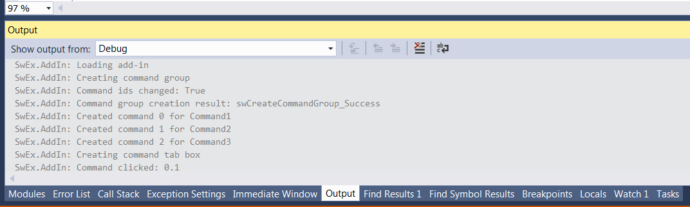
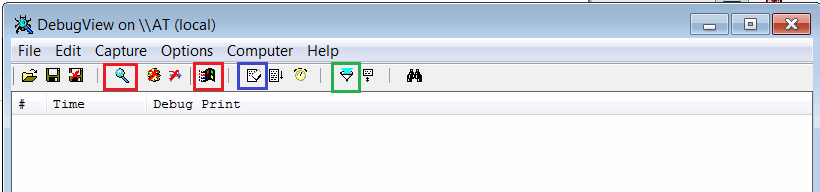
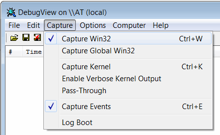
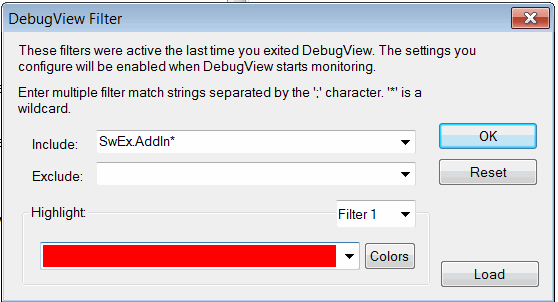
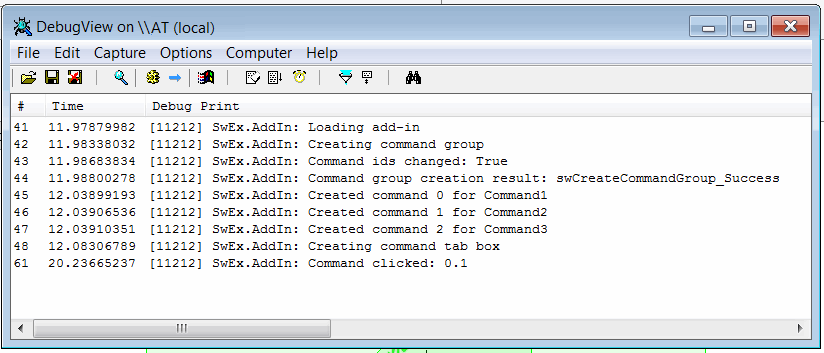

SwEx framework outputs the trace messages which simpifies the troubleshooting process. The messages are output to the default trace listener.

If add-in is debugged from Visual studio than the messages are output to Visual studio Output tab as shown below:

{ width=450 }

Otherwise messages can be traced via [DebugView](https://docs.microsoft.com/en-us/sysinternals/downloads/debugview) utility by Microsoft

* Download the utility from the link above
* Unzip the package and run *Dbgview.exe*
* Set the settings as marked below:

Enable *Capture Win32* and *Capture Events* options from the toolbar (marked in red) 
    
{ width=450 }

Alternatively set the capture options via menu as shown below:

{ width=350 }

Set the filter to filter SwEx messages by clicking the filter button (marked in green)

{ width=350 }

Messages will be output to trace window

{ width=450 }

Use *eraser* button to clean messages (marked in blue)

## Notes
* Trace output is very powerful tool for troubleshooting the add-in on clients computers
* DebugView tool is lightweight and doesn't require installation and is provided by Microsoft
* Trace messages will be also output in the release mode
* SwEx framework will output the exception details if thrown while loading of the add-in which can help solving the problem when add-in cannot be loaded

Custom messages and exceptions can be logged from SwEx module. Follow [this link](logging) for more information.