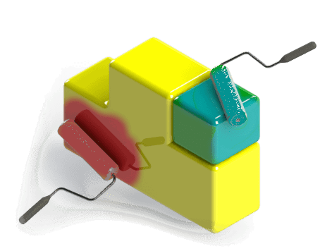

This section contains the articles and code examples which explain the different ways of customizing the view of the SOLIDWORKS model and application frame using API.

This includes, but not limited to

* Adding [callout](/solidworks-api/adornment/callouts/) objects
* Injecting custom 3D graphics to the model view via Open GL
* Adding 2D images on the graphics view
* Embedding [OLE objects](solidworks-api/adornment/ole-objects/) into the model
