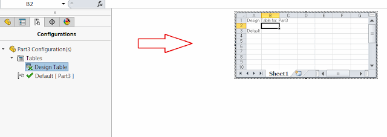

This example demonstrates how to resize and move the design table OLE object in the graphics area using [ISwOLEObject::Boundaries](http://help.solidworks.com/2018/english/api/sldworksapi/solidworks.interop.sldworks~solidworks.interop.sldworks.iswoleobject~boundaries.html) SOLIDWORKS API method.

{ width=640 height=226 }

In this example an existing design table element will be moved to the right on the distance equals to object's width


