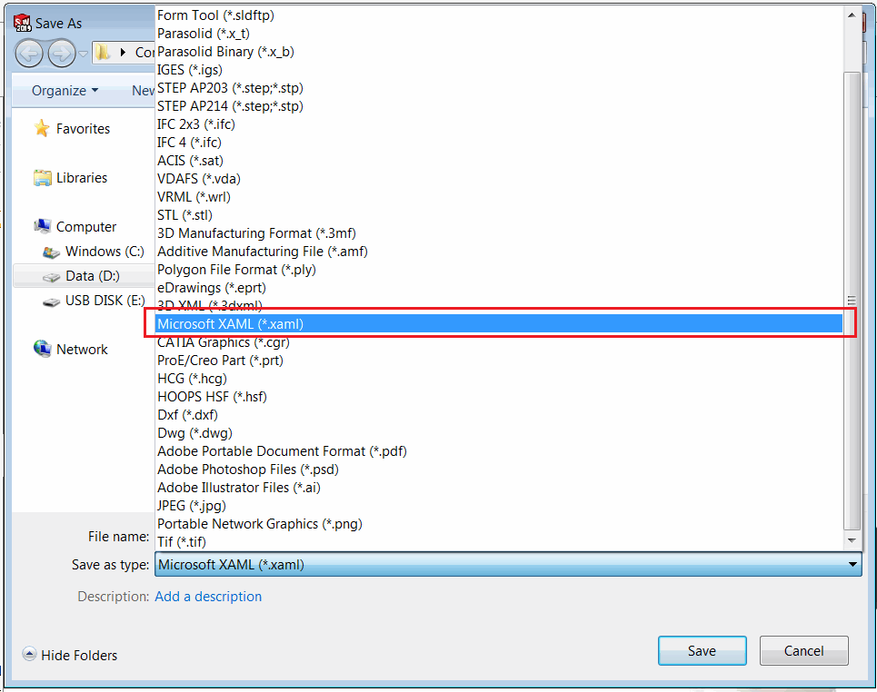
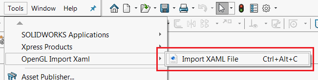
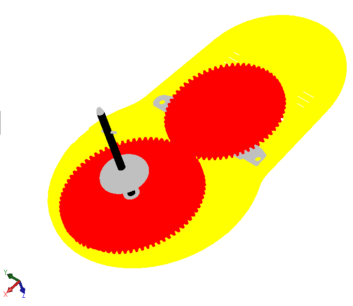

This C# add-in demonstrates how to import the geometry in the [XAML](https://en.wikipedia.org/wiki/Extensible_Application_Markup_Language) file into the active model space using SOLIDWORKS API. To achieve the maximum performance the graphics is rendered using the [Vertex Buffer Object (VBO)](https://en.wikipedia.org/wiki/Vertex_buffer_object) feature of OpenGL.

[OpenTK](https://opentk.net/) library is used to invoke OpenGL APIs.

Add-in can import the XAML files created from Part documents only (XAML files from the assembly are not supported).

XAML file export format supported natively by SOLIDWORKS. Use *File->Save As* menu command to export file in the XAML format.

{ width=550 }

However this format cannot be imported natively. Add-in adds the *Import XAML File* commands into the menu. Open new or existing file and import xaml using this command.

{ width=450 }

Graphics is rendered using OpenGL. Model can be rotated, zoomed, panned. There are no feature elements or temp bodies created and graphics is rendered with high performance.

{ width=350 }

By default graphics of OpenGL is not respected by zoom commands. I.g. *Zoom To fit* fill not fit the geometry properly and would ignore its bounding box. To specify the visible boundaries it is required to use the [IModelDocExtension::SetVisibleBox](http://help.solidworks.com/2017/english/api/sldworksapi/SolidWorks.Interop.sldworks~SolidWorks.Interop.sldworks.IModelDocExtension~SetVisibleBox.html) SOLIDWORKS API method. Note, it is not required to union the existing visible box of native SOLIDWORKS geometry, SOLIDWORKS will perform this operation automatically.

Source code can be downloaded from [GitHub](https://github.com/codestackdev/solidworks-api-examples/tree/master/swex/add-in/opengl/XamlImporter)

## AddIn.cs

This the add-in entry point. [SwEx.AddIn](/labs/solidworks/swex/add-in/) framework is used to manage documents lifecycle by providing the wrapper class. Import command is handled in the add-in and [Model3DGroup](https://docs.microsoft.com/en-us/dotnet/api/system.windows.media.media3d.model3dgroup) object of Microsoft WPF framework is extracted from the specified XAML file.



## MeshRendererModel.cs

This is a handler class for each model document which subscribes to the OpenGL Buffer Swap notification provided by SOLIDWORKS and performs the binding and rendering of VBO based on the provided mesh data.


