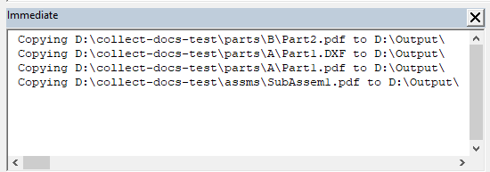

This VBA macro allows to collect all output files such as DXF, DWG, PDF etc. from all referenced parts and sub-assembly documents on all levels and copy to a specified folder.

Referenced parts and sub-assemblies can be located in any directory. It is not required those to be in the same folder or drive of a main assembly.

For example the main assembly **TopAssm1.sldasm** is saved in **C:\Assms** folder and it refers 2 part files located in **D:\Parts\A\Part1.sldprt** and **D:\Parts\B\Part2.sldprt**. DXF and PDF files were created for Part1 and Part2 and saved in the same folder, i.e. **D:\Parts\A\Part1.dxf**, **D:\Parts\A\Part1.pdf**, **D:\Parts\B\Part2.dxf**, **D:\Parts\B\Part2.pdf**. As the result of running this macro all those 4 files will be copied to the specified output folder.

## Notes

* Reference documents must have the same name as the file they derived from, i.e. **Part1.pdf** is derived from **Part1.sldprt**
* Reference documents of the main assembly will also be included
* Macro will open the folder browse dialog to select the output folder
* All file paths which are copied are output to the *Immediate* window of VBA editor
* Suppressed components will not be included into the collection
* Assembly opened in Large Design Review mode is not supported

## Configuration

Macro can be configured by changing the constants at the beginning of the macro

~~~ vb
Const SEARCH_SUB_FOLDERS As Boolean = False
Const EXTENSIONS As String = "dxf,pdf"
Const ALLOW_OVERWRITE As Boolean = False
~~~

**SEARCH_SUB_FOLDERS** indicates if macro should recursively search referenced documents. If this option is set to **False** only files next to the source files will be collected (e.g. Part1.dxf must be in the same folder as Part1.sldprt). In some cases output files can be placed into sub-folders (e.g. DXFs\Part1.dxf of Part1.sldprt) to collect such files set the **SEARCH_SUB_FOLDERS** to **True**. Note, if any child folder contains another file with the same name it will also be collected (e.g. A\B\C\Part1.pdf).

**EXTENSIONS** is a comma-separated list of file extension to collect.

**ALLOW_OVERWRITE** option indicates if the files in the destination directory need to be overwritten if exist. It is recommended to set this option to **False** and manually clean the target directory. This would reduce the risk of overwriting the files and catching the potential errors.

