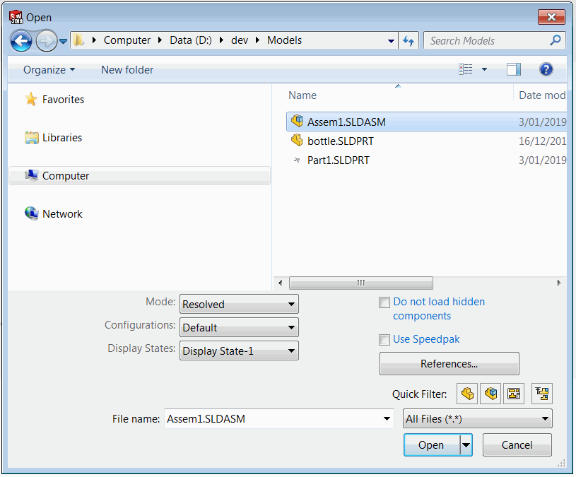
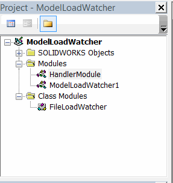



This VBA macro handles document load events using SOLIDWORKS API and runs a custom code for each of the documents.

Macro operates in the background and needs to be run once a session to start monitoring.

Both visible (opened in its own window) and invisible (opened as assembly or drawing component) documents are handled.

{ width=350 }

## Configuration

* Create new macro
* Copy the code into corresponding modules of the macro. The VBA macro tree should look similar to the image below:

{ width=250 }

* Place your code into the *main* sub of the *HandlerModule* module. The pointer to [IModelDoc2](http://help.solidworks.com/2012/english/api/sldworksapi/SolidWorks.Interop.sldworks~SolidWorks.Interop.sldworks.IModelDoc2.html) document is passed as the parameter. Use this pointer instead of [ISldWorks::ActiveDoc](http://help.solidworks.com/2012/english/api/sldworksapi/solidworks.interop.sldworks~solidworks.interop.sldworks.isldworks~activedoc.html) to properly handle invisible documents.

~~~ vb
Sub main(model As SldWorks.ModelDoc2)
    'TODO: add your routine here
End Sub
~~~

* It might be useful to automatically run this macro with each session of SOLIDWORKS. Follow the [Run SOLIDWORKS macro automatically on application start](solidworks-api/getting-started/macros/run-macro-on-solidworks-start/) link for more information.

## Macro Module

Entry point which starts events monitoring



## FileLoadWatcher Class Module

Class which handles SOLIDWORKS API notifications



## HandlerModule Module

Custom VBA code which needs to be run for each opened document


