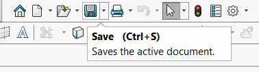

This VBA macro handles active document (part, assembly or drawing) save events (including save all and save as) using SOLIDWORKS API and runs a custom code.

Macro operates in the background and needs to be run once a session to start monitoring.

## Configuration

* Create new macro
* Place the code from the [Macro Module](#macro-module) to the default module
* Add the code which needs to be executed on each save into the *OnSaveDocument* function

~~~ vb
Sub OnSaveDocument(Optional dummy As Variant = Empty)
    'TODO: place the code here to run whn document is saved
    MsgBox "Saved"
End Sub
~~~

* To simplify this function you can call another macro without explicitly copying the code. Explore the [Run Group Of Macros](/solidworks-api/application/frame/run-macros-group/) example.

* Add new Class Module and name it *SaveEventsHandler*. Paste the code from the [SaveEventsHandler Class Module](#saveeventshandler-class-module)

* It might be useful to automatically run this macro with each session of SOLIDWORKS. Follow the [Run SOLIDWORKS macro automatically on application start](solidworks-api/getting-started/macros/run-macro-on-solidworks-start/) link for more information.

## Macro Module

Entry point which starts events monitoring and handles the code which needs to be run once the save event arrives.



## SaveEventsHandler Class Module

Class which handles SOLIDWORKS API save notifications


