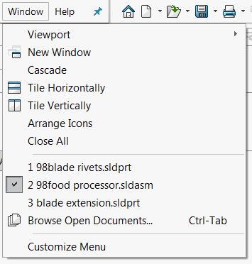

{ width=250 }

This macro utilizes SOLIDWORKS API and closes all opened documents except of an active one.

If document is dirty (i.e. has any unsaved changes) the macro will prompt user to specify the action (save, do not save or cancel) for the closing documents. Otherwise the document will be closed silently.

Watch [video demonstration](https://youtu.be/9uZCecGg25I?t=166)


