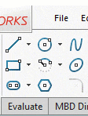

This VBA macro demonstrates how to flash standard toolbar buttons in SOLIDWORKS toolbars similarly to SOLIDWORKS tutorials files.

In order to flash toolbar it is required to find its id. Follow the [Calling Windows Commands](https://blog.codestack.net/missing-solidworks-api-command#calling-windows-command) section of the blog post for the instruction of how retrieve this id.

> Note, the id of command is persistent across SOLIDWORKS sessions and releases.

Unlike standard commands, custom commands added with [SOLIDWORKS add-ins](/solidworks-api/getting-started/add-ins/) are not persistent across different installations. In order to dynamically retrieve the id of the custom command, use [ISldWorks::GetCommandID](httpss://help.solidworks.com/2017/english/api/sldworksapi/SolidWorks.Interop.sldworks~SolidWorks.Interop.sldworks.ISldWorks~GetCommandID.html) API and pass persistent **command user id** and guid of the add-in.

