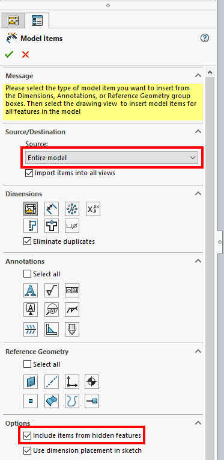
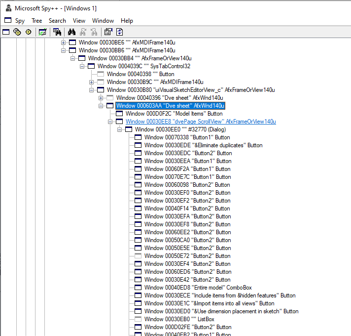

In some cases certain SOLIDWORKS functions or options may not be available within SOLIDWORKS API commands or may work incorrectly.

In this case one of the possible workarounds (if other workarounds are not available) is to use Windows API to invoke and configure the commands.

This example demonstrate how to insert model dimensions into the SOLIDWORKS drawing view using Windows API. This example emulates the functionality of [IDrawingDoc::InsertModelAnnotations3](https://help.solidworks.com/2015/english/api/sldworksapi/solidworks.interop.sldworks~solidworks.interop.sldworks.idrawingdoc~insertmodelannotations3.html) API methods.

{ width=400 }

This is a C# Console Application which accepts the path to a drawing as an input parameter. The following steps will be performed:

* Connect or create new instance of SOLIDWORKS
* Open the specified drawing file
* Open the **Insert Model Items** property manager page by running the command using SOLIDWORKS API
* Iterate all controls and set the source to **Entire Model** and **Include items from hidden features** option
* Close Property Manager Page by clicking OK button
* Save and close the document

While invoking Windows API it is required to develop a strategy of finding the specific controls and command ids.

Spy++ utility by Microsoft which is built-in into Visual Studio can be a useful tool to analyze Windows controls:

{ width=400 }

Refer [Calling Windows API commands](https://blog.codestack.net/missing-solidworks-api-command#calling-windows-command) blog article for more information about this method.

## Limitations

* Low-level code which is less readable and more complex
* In some cases there is no permanent ids of controls, so it is required to use additional logic such as control title or order which may differ from session to session, release to release or be locale dependent
* Windows API performs a low level calls so it is required to be careful working with memory, releasing pointers, etc. as it may cause an unexpected behavior. Read Windows API documentation for more information about the specific API calls
* There is no feedback about the result of the operation (only low level API results) which means that it may be hard to identify if operation performed successfully. The operation may also produce model popup windows which needs to be handled separately.

